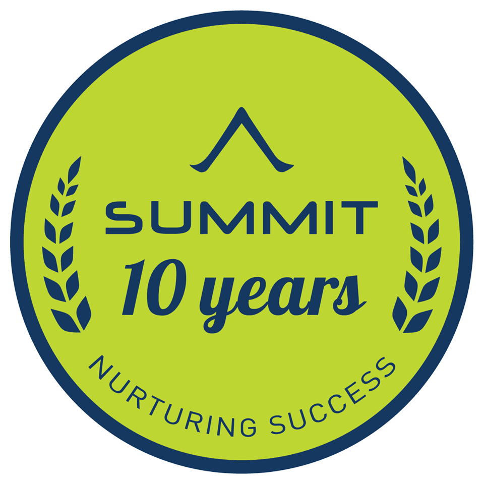

# Bộ phận KSCL

## Bộ phận QLCL làm công việc gì? Thuộc hệ thống phòng ban nào?

* QLCL tiền thân thuộc bộ phận ELT - Phòng Kinh Doanh, từ 01/01/2021 tách ra  trở thành BP riêng biệt, phụ trách các mảng: TVTS, TVGL, TVTK, CSHV
* Kiểm soát các loại rủi ro trong quy trình tuyển sinh, chăm sóc HV. Là công việc để trả lời các câu hỏi sau: Nhân viên **X có mắc lỗi Y \(C01... C05..\) trong tuần hay không?** Đưa ra cảnh báo gì? Đề xuất phòng tránh rủi ro ra sao?

## Ý nghĩa của bộ tài liệu này?

### Mục tiêu:

* Đảm bảo NV **tiếp nhận kiến thức chủ động** \(không bị động - chỉ nghe\)
* Đặt **hiệu quả** lên hàng đầu. Đảm bảo NV training xong làm được luôn và người training nắm đc kết quả làm việc của NV, nên Gitbook này được thiết theo logic hành động.
* Hiệu quả **tra cứu** tối đa. NV sau quá trình training có thể sẽ thực hành tốt công việc nhưng sẽ chưa thể ghi nhớ hết toàn bộ nội dung, nên Gitbook này cũng được thiết kế với ngôn từ, thao tác tra cứu **tinh giản** nhất.

### Kế hoạch training

<table>
  <thead>
    <tr>
      <th style="text-align:left"></th>
      <th style="text-align:left"></th>
    </tr>
  </thead>
  <tbody>
    <tr>
      <td style="text-align:left">B&#x1B0;&#x1EDB;c 1. Chu&#x1EA9;n b&#x1ECB;</td>
      <td style="text-align:left">G&#x1EED;i Gitbook &#x111;&#x1EC3; NV t&#x1EF1; &#x111;&#x1ECD;c</td>
    </tr>
    <tr>
      <td style="text-align:left">B&#x1B0;&#x1EDB;c 2. Training</td>
      <td style="text-align:left">
        
+ H&#x1ECF;i khi n&#xE0;o HV s&#x1EB5;n s&#xE0;ng training

        
+ Training: Thuy&#x1EBF;t tr&#xEC;nh v&#x1EDB;i Gitbook

        
+ HV &#x111;&#x1EB7;t c&#xE2;u h&#x1ECF;i, gi&#x1EA3;i &#x111;&#xE1;p

        
+ HV t&#x1EF1; t&#x1EAD;p l&#xE0;m

      </td>
    </tr>
    <tr>
      <td style="text-align:left">B&#x1B0;&#x1EDB;c 3. Nghi&#x1EC7;m thu</td>
      <td style="text-align:left">
        
+ Ki&#x1EC3;m tra ch&#x1EA5;t l&#x1B0;&#x1EE3;ng s&#x1EA3;n ph&#x1EA9;m
          HV t&#x1EF1; l&#xE0;m

        
+ Nh&#x1EAD;n x&#xE9;t, r&#xFA;t kinh nghi&#x1EC7;m

        
+ HV &#x111;&#x1EB7;t c&#xE2;u h&#x1ECF;i, gi&#x1EA3;i &#x111;&#xE1;p

      </td>
    </tr>
  </tbody>
</table>

### Đào Diệu Liên HN, 

3 phút Phần quy trình đào tạo của QLCL để tối ưu thêm gồm đủ phần A \(attitude và đinh hướng ngành nghề, làm thế nào để trở thành 1 QLCL tốt, các điểm chống shoock khi bước vào nghề \) S kỹ năng và K kiến thức gồm có kiến thức chung và kiến thức về ngành QLCL. Phần kiến thức chung bạn nên được học thêm về Đặc điểm của nhân viên sales và KH của SM , tương tự sau này CSHV cũng vậy , và quản trị chất lượng sẽ giúp ích gì được cho bộ máy sales đạt KPI. Bạn phải hiểu mình là mắt xích và mang lại lợi ích gì thì sẽ vững tinh thần hơn khi gặp các vấn đề

"Giai đoạn đầu : Quản lý sát sao =&gt;NV sẽ thích và đi theo Giai đoạn 2 : Gắn kết do tiền \( tức là họ thấy thành quả mình làm ra , thu nhập thể hiện năng suất và sự cố gắng, thu nhập có thể giúp bạn trang trải cuộc sống và lo cho mẹ \) =&gt; yêu thích công việc. Giai đoạn 3 gắn kết do thấy sự phát triển \(tăng level lên/1-2 năm thấy phát triển lên ngạch QL dc\) GD4 gắn kết do ý nghĩa của ngành nghề mà mình làm, thích ngành giáo dục =&gt;công thức để NV mới gắn kết ^^, nên giai đoạn này chỉ cần hỗ trợ sát là được"

