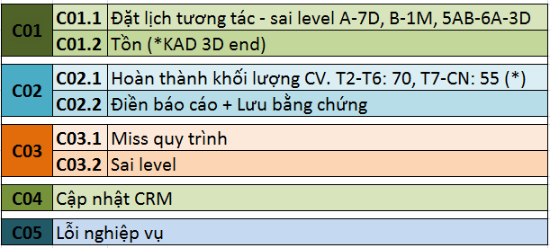

# 1.Cơ chế Thẻ Xanh-Đỏ

### Giới thiệu chung

Cơ chế KSCL của Summit đề cao việc **cải thiện chất lượng TVTS** lên hàng đầu. Vì vậy chúng tôi chấp nhận những sai sót và tập trung và kế hoạch, giải pháp cải thiện chất lượng. Hệ thống cơ chế Thẻ Xanh/Đỏ chỉ nhằm mục tiêu: cảnh báo/giúp đỡ các TVTS trong quá trình nâng cao trình độ, tạo động lực/động viên TVTS duy trì, phát triển thế mạnh sẵn có hoặc tiềm tàng.

### Cách vận hành

<table>
  <thead>
    <tr>
      <th style="text-align:left"></th>
      <th style="text-align:left"></th>
    </tr>
  </thead>
  <tbody>
    <tr>
      <td style="text-align:left">C&#xE1;ch v&#x1EAD;n h&#xE0;nh</td>
      <td style="text-align:left">- T&#x1EB7;ng cts t&#x1B0;&#x1A1;i cho TVTS c&#xF3; Th&#x1EBB; Xanh
         - Gi&#x1EA3;m cts, kh&#x1ED1;i l&#x1B0;&#x1EE3;ng c&#xF4;ng vi&#x1EC7;c
        cho TVTS c&#xF3; Th&#x1EBB; &#x110;&#x1ECF; &#x111;&#x1EC3; &#x111;&#x1EA7;u
        t&#x1B0; ho&#xE0;n thi&#x1EC7;n k&#x1EF9; n&#x103;ng, nghi&#x1EC7;p v&#x1EE5;.</td>
    </tr>
    <tr>
      <td style="text-align:left">L&#x1EE3;i &#xED;ch</td>
      <td style="text-align:left">
        
L&#x1EE3;i &#xED;ch 3 b&#xEA;n:

        
- C&#xF4;ng ty: Ngu&#x1ED3;n cts &#x111;&#x1B0;&#x1EE3;c s&#x1EED; d&#x1EE5;ng
          hi&#x1EC7;u qu&#x1EA3; nh&#x1EA5;t

        
- KH: &#x111;&#x1B0;&#x1EE3;c tr&#x1EA3;i nghi&#x1EC7;m ch&#x1EA5;t l&#x1B0;&#x1EE3;ng
          DV t&#x1ED1;t nh&#x1EA5;t

        
- TVTS &amp; c&#x1A1; s&#x1EDF;: &#x111;&#x1B0;&#x1EE3;c t&#x1EA1;o m&#xF4;i
          tr&#x1B0;&#x1EDD;ng c&#x1EA1;nh tranh c&#xF4;ng b&#x1EB1;ng, t&#x103;ng
          &#x111;&#x1ED9;ng l&#x1EF1;c ph&#xE1;t tri&#x1EC3;n gi&#x1EEF;a c&#xE1;c
          TVTS v&#x1EDB;i nhau v&#xE0; gi&#x1EEF;a c&#xE1;c chi nh&#xE1;nh.

        
C&#x1EE5; th&#x1EC3;: D&#x1EF1;a v&#xE0;o ch&#x1EA5;t l&#x1B0;&#x1EE3;ng
          ch&#x103;m s&#xF3;c cts t&#x1ED1;i &#x1B0;u hay ch&#x1B0;a t&#x1ED1;i &#x1B0;u
          &#x111;&#x1EC3; ph&#xE2;n b&#x1ED1; ngu&#x1ED3;n l&#x1EF1;c cts

        
Ngo&#xE0;i ra, l&#x1EE3;i &#xED;ch c&#x1EE7;a th&#x1EBB; &#x111;&#x1ECF;
          l&#xE0; gi&#x1EA3;m t&#x1EA3;i &#xE1;p l&#x1EF1;c th&#x1EDD;i gian, &#xE1;p
          l&#x1EF1;c kh&#x1ED1;i l&#x1B0;&#x1EE3;ng c&#xF4;ng vi&#x1EC7;c gi&#xFA;p
          TVTS c&#xF3; th&#xEA;m th&#x1EDD;i gian &#x111;&#x1EC3; &#x111;i&#x1EC1;u
          ch&#x1EC9;nh nghi&#x1EC7;p v&#x1EE5;, ho&#xE0;n thi&#x1EC7;n h&#x1A1;n

      </td>
    </tr>
    <tr>
      <td style="text-align:left">BP</td>
      <td style="text-align:left">TVTS - Team leader TVTS - SS - QLCL. (SS ch&#x1EC9; h&#x1ED7; tr&#x1EE3;)</td>
    </tr>
  </tbody>
</table>

Cập nhật cơ chế Thẻ Xanh - Đỏ tại: [**https://bit.ly/3coFjXL**](https://bit.ly/30s0hTm)\*\*\*\*

**\*Lưu ý:**

* Giảm 1 bậc thẻ đỏ khi doanh số \(DS\)/tuần &gt; 70%
* Tăng 1 bậc thẻ đỏ khi cùng 1 lỗi mắc đến 3 lần/tuần

### Code lỗi +CẦN CẬP NHẬT THÊM LỖI EMAIL

Định nghĩ chi tiết về các code lỗi xem tại page tiếp theo --&gt;

