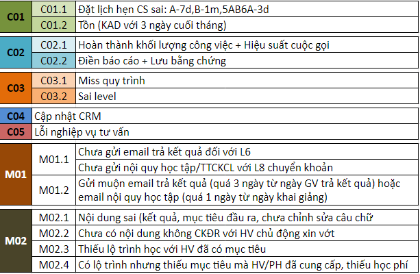

# 1.Cơ chế Thẻ Xanh-Đỏ

### Giới thiệu chung

Cơ chế KSCL của Summit đề cao việc **cải thiện chất lượng TVTS** lên hàng đầu. Vì vậy chúng tôi chấp nhận những sai sót và tập trung vào kế hoạch, giải pháp cải thiện chất lượng. Hệ thống cơ chế Thẻ Xanh/Đỏ chỉ nhằm mục tiêu: cảnh báo/giúp đỡ các TV trong quá trình nâng cao trình độ, tạo động lực/động viên TV duy trì, phát triển thế mạnh sẵn có hoặc tiềm tàng.

### Cách vận hành

|                     |                                                                                                                                                                                                                                                                                                                                                                                                                                                                                                                                            |
| ------------------- | ------------------------------------------------------------------------------------------------------------------------------------------------------------------------------------------------------------------------------------------------------------------------------------------------------------------------------------------------------------------------------------------------------------------------------------------------------------------------------------------------------------------------------------------ |
| Cách vận hành       | 
- Tặng cts tươi cho TVTS có Thẻ Xanh - Giảm cts, khối lượng công việc cho TVTS có Thẻ Đỏ để dành thời gian đầu tư hoàn thiện kỹ năng, nghiệp vụ.
                                                                                                                                                                                                                                                                                                                                                                                 |
| Lợi ích             | 
Lợi ích 3 bên:

- Công ty: Nguồn cts được sử dụng hiệu quả nhất

- KH: được trải nghiệm chất lượng DV tốt nhất

- TVTS &#x26; cơ sở: được tạo môi trường cạnh tranh công bằng, tăng động lực phát triển giữa các TVTS với nhau và giữa các chi nhánh.

Cụ thể: Dựa vào chất lượng chăm sóc cts tối ưu hay chưa tối ưu để phân bố nguồn lực cts

Ngoài ra, lợi ích của thẻ đỏ là giảm tải áp lực thời gian, áp lực khối lượng công việc giúp TVTS có thêm thời gian để điều chỉnh nghiệp vụ, hoàn thiện hơn
 |
| Quy trình phối hợp  | TVTS/TVGL/TVTK <--> **Team leader ** <--> QLCL                                                                                                                                                                                                                                                                                                                                                                                                                                                                                             |

.png>)

.png>)

Cập nhật cơ chế Thẻ Xanh - Đỏ tại: t.ly/1yTt 

**\*Lưu ý:**

* Giảm 1 bậc thẻ đỏ khi doanh số (DS)/tuần > 70%
* Tăng 1 bậc thẻ đỏ khi cùng 1 lỗi mắc đến 3 lần/tuần

### Code lỗi 

Định nghĩa chi tiết về các code lỗi xem tại page tiếp theo -->
