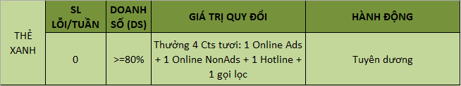
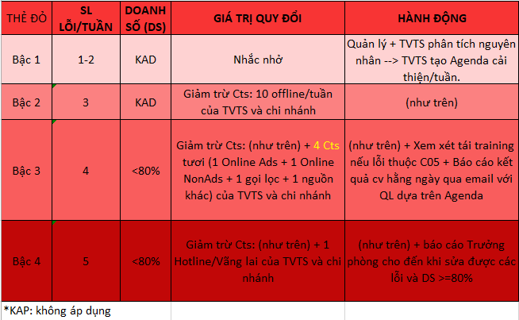

# 1.Cơ chế Thẻ Xanh-Đỏ

Cơ chế KSCL của Summit đề cao việc **cải thiện chất lượng TVTS** lên hàng đầu. Vì vậy chúng tôi chấp nhận những sai sót và tập trung và kế hoạch, giải pháp cải thiện chất lượng. Hệ thống cơ chế Thẻ Xanh/Đỏ chỉ nhằm mục tiêu: cảnh báo/giúp đỡ các TVTS trong quá trình nâng cao trình độ, tạo động lực/động viên TVTS duy trì, phát triển thế mạnh sẵn có hoặc tiềm tàng.

## Giới thiệu chung

|  |  |
| :--- | :--- |

<table>
  <thead>
    <tr>
      <th style="text-align:left">C&#x1A1; ch&#x1EBF; Th&#x1EBB; Xanh/&#x110;&#x1ECF; v&#x1EAD;n h&#xE0;nh
        nh&#x1B0; th&#x1EBF; n&#xE0;o?</th>
      <th style="text-align:left">
        
- T&#x1EB7;ng Cts t&#x1B0;&#x1A1;i v&#x1EDB;i TVTS kh&#xF4;ng m&#x1EAF;c
          l&#x1ED7;i (Th&#x1EBB; Xanh)

        
- Gi&#x1EA3;m b&#x1EDB;t Cts v&#x1EDB;i TVTS c&#xF2;n ch&#x1B0;a ho&#xE0;n
          thi&#x1EC7;n k&#x1EF9; n&#x103;ng, nghi&#x1EC7;p v&#x1EE5; &#x111;&#x1EC3;
          TVTS c&#xF3; th&#xEA;m th&#x1EDD;i gian trau chu&#x1ED1;t, r&#xE8;n luy&#x1EC7;n.
          (Th&#x1EBB; &#x110;&#x1ECF;)

      </th>
    </tr>
  </thead>
  <tbody></tbody>
</table><table>
  <thead>
    <tr>
      <th style="text-align:left">&#x110;em l&#x1EA1;i l&#x1EE3;i &#xED;ch g&#xEC;?</th>
      <th style="text-align:left">
        
C&#x1A1; ch&#x1EBF; n&#xE0;y mang l&#x1EE3;i &#xED;ch &#x111;&#x1EBF;n
          cho 3 b&#xEA;n:

        
- C&#xF4;ng ty: ngu&#x1ED3;n Cts &#x111;&#x1B0;&#x1EE3;c s&#x1EED; d&#x1EE5;ng
          hi&#x1EC7;u qu&#x1EA3; nh&#x1EA5;t
           - Kh&#xE1;ch h&#xE0;ng: Ch&#x1EA5;t l&#x1B0;&#x1EE3;ng DV CSKH .
           - TVTS &amp; chi nh&#xE1;nh: T&#x1EA1;o t&#xED;nh c&#x1EA1;nh tranh c&#xF4;ng
          b&#x1EB1;ng, l&#xE0;m &#x111;&#x1ED9;ng l&#x1EF1;c ph&#xE1;t tri&#x1EC3;n
          gi&#x1EEF;a c&#xE1;c TVTS v&#xE0; gi&#x1EEF;a c&#xE1;c chi nh&#xE1;nh.
          C&#x1EE5; th&#x1EC3;: d&#x1EF1;a v&#xE0;o ch&#x1EA5;t l&#x1B0;&#x1EE3;ng
          ch&#x103;m s&#xF3;c Cts (t&#x1ED1;i &#x1B0;u hay ch&#x1B0;a t&#x1ED1;i
          &#x1B0;u) c&#x1EE7;a t&#x1EEB;ng chi nh&#xE1;nh &#x111;&#x1EC3; ph&#xE2;n
          b&#x1ED5; ngu&#x1ED3;n l&#x1EF1;c.
           Ngo&#xE0;i ra, l&#x1EE3;i &#xED;ch c&#x1EE7;a th&#x1EBB; &#x111;&#x1ECF;
          l&#xE0; gi&#x1EA3;m t&#x1EA3;i &#xE1;p l&#x1EF1;c th&#x1EDD;i gian, &#xE1;p
          l&#x1EF1;c kh&#x1ED1;i l&#x1B0;&#x1EE3;ng c&#xF4;ng vi&#x1EC7;c gi&#xFA;p
          TVTS c&#xF3; th&#xEA;m th&#x1EDD;i gian &#x111;&#x1EC3; &#x111;i&#x1EC1;u
          ch&#x1EC9;nh nghi&#x1EC7;p v&#x1EE5;, ho&#xE0;n thi&#x1EC7;n h&#x1A1;n.

      </th>
    </tr>
  </thead>
  <tbody></tbody>
</table>| Áp dụng tại BP nào? | TVTS - Teamleader TVTS - Bộ phận đào tạo, QLCL, Sale Suport \(chỉ phối hợp, nhận và xử lý thông tin\) |
| :--- | :--- |

| Cấp độ thẻ | Thẻ Xanh, Thẻ Đỏ \(bậc 1-2-3-4\) tương ứng với số lỗi. |
| :--- | :--- |

**Lưu ý:**

* Giảm 1 bậc thẻ đỏ khi doanh số \(DS\)/tuần &gt;= 80%
* Tăng 1 bậc thẻ đỏ khi Hattrick - lặp lại 1 lỗi 3 lần/tuần

