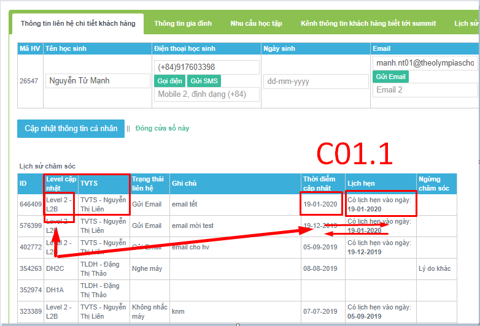
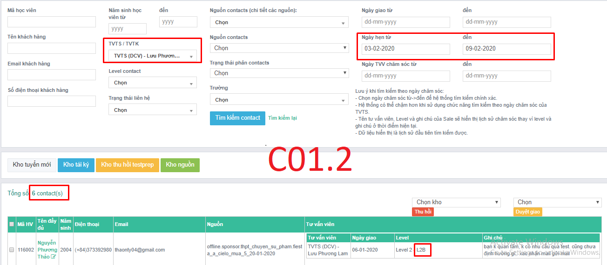

# C01-Lịch hẹn tái chăm sóc

### C01.1-Đặt sai lịch hẹn tương tác

* Đặt lịch hẹn tương tác **cho level** sai quy định.
* Tối đa level A-7 ngày, B-1 tháng, 6A-3 ngày, 5AB-3 ngày

### C01.2-Tồn

* Tồn: Không tương tác khi đến lịch hẹn.

**Ngoại lệ:**

* **3 ngày cuối tháng** chốt DS, TVTS được phép để tồn nhưng sau ngày này, chỉ có 1 ngày full để xử toàn bộ tồn. 
* Sau khi nghỉ off, đi làm trở lại cần giải quyết tồn, có thể ưu tiên level A của ngày hiện tại và ngày tồn trước. Miễn sao đến ngày deadline giải quyết hết toàn bộ tồn trong giai đoạn cho phép. Công thức quy định thời gian giải quyết Tồn: **N + 1** \(N là số ngày nghỉ off, làm tròn\)
* Level C,7,8, Cts phân bù được phép tồn

