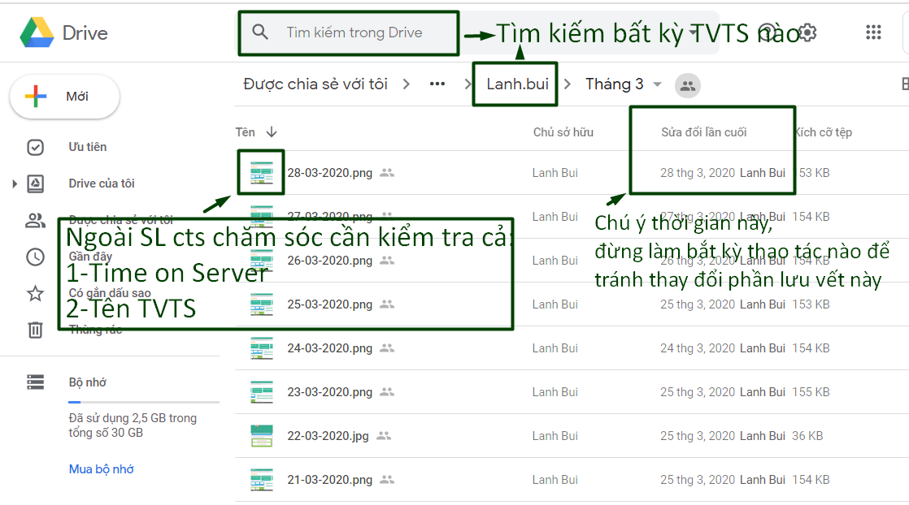

# C02-Khối lượng CV

## C02.1-Hoàn thành khối lượng CV

**1.Quy định:**

* Không áp dụng với **3 ngày cuối tháng**
* **Giờ làm việc thực tế** = 8 giờ - thời gian họp, về sớm, đi muộn...

2. TVTS báo cáo khối lượng công việc tại [https://t.ly/lz82](https://t.ly/lz82) _\(cần check tính xác thực kèm với code C02.2\)_

## C02.2-Điền báo cáo + Lưu bằng chứng

* TV cần cập nhật khối lượng công việc **theo ngày** tại: [https://t.ly/lz82](https://t.ly/lz82)

* Cập nhật khối lượng công việc **theo ngày** vào folder "Kết quả công việc của phòng TVTS". Link: [http://bit.ly/2Tehfk8](http://bit.ly/2Tehfk8)

