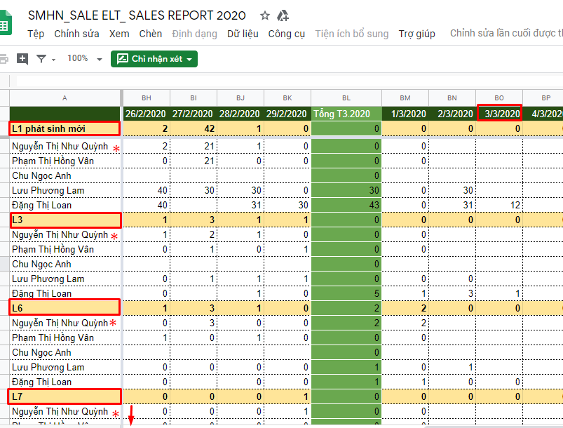
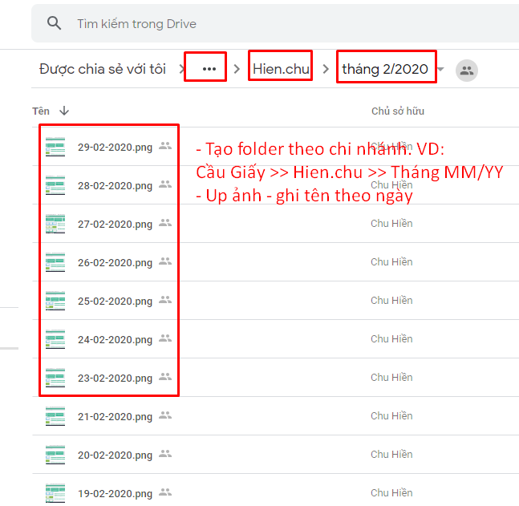

# C02-Khối lượng CV

## C02.1-Hoàn thành khối lượng CV

TVTS cần hoàn thành **khối lượng công việc** theo ngày: Link: [http://bit.ly/2Te5Bpi](http://bit.ly/32L6M2u)

* T2-T6 &gt;=70 Cts
* T7-CN &gt;=55 Cts
* Không áp dụng với **3 ngày cuối tháng**
* Nếu TVTS về sớm thì Khối lượng công việc tiêu chuẩn = số tiếng làm thực tế/8 x SL Cts tiêu chuẩn theo ngày.

## C02.2-Điền báo cáo + Lưu bằng chứng

Cập nhật khối lượng công việc **theo ngày** vào folder "Kết quả công việc của phòng TVTS". Link: [http://bit.ly/2Tehfk8](http://bit.ly/2Tehfk8)

Riêng TVTS của bộ phận KSCL gửi tại đây: [http://bit.ly/2Td4fLj](http://bit.ly/2Td4fLj)

* Số lượng Cts L1-3-6-8 
* Tổng số Cts chăm sóc

