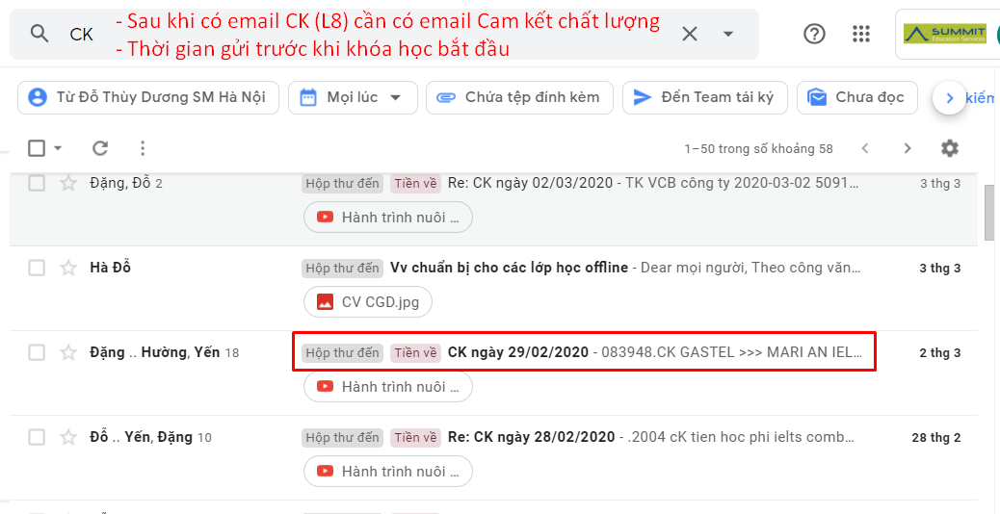
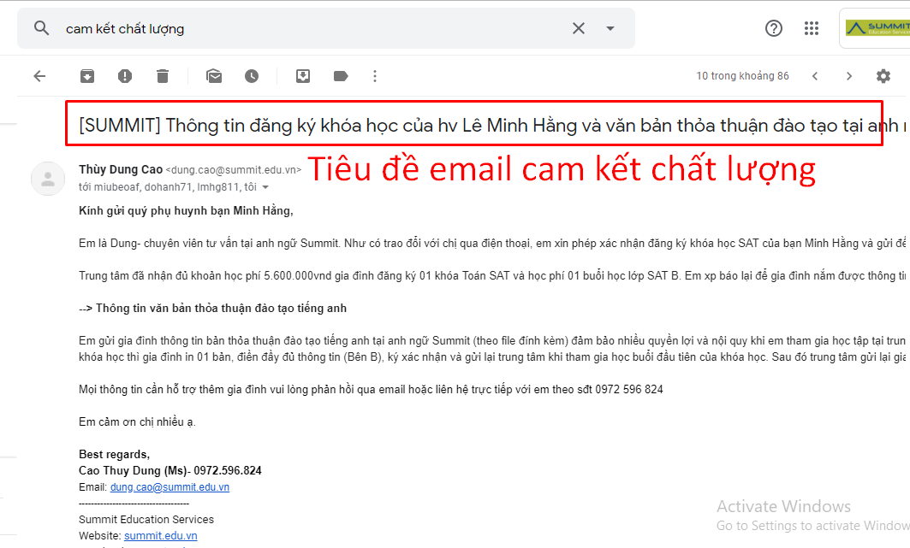
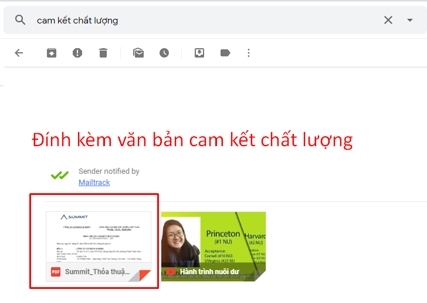

# Email M01 - M02

### Phạm vi kiểm soát email?

Tại nguồn học viên

* **Bỏ check email: 1-1, Fulltest 1-1, TVDH, ACT, CSHV**
* Chọn check email: SAT, đã có hẹn TVTS/TVTK,Giới thiệu,gọi lọc,hotline,vãng lại, nguồn khác,Fulltest của TVTS

### Mục đích check email?

* Cảnh báo email _sắp đến hạn, quá hạn_ gửi kết quả
* Cảnh báo nội dung email chưa chính xác 

### Công cụ nào hỗ trợ check email?

* Đăng nhập CRM với TK Quản lý Sale: [https://mol.summit.edu.vn](https://mol.summit.edu.vn)
* Hòm thư Quản lý sale: storage.tvts@summit.edu.vn
* **Báo cáo Excel**: [http://bit.ly/2HmVwjf](http://bit.ly/398VuHP)
* Form báo cáo lỗi: [http://bit.ly/39zZ1yM](http://bit.ly/39zZ1yM)

### **Quy định về gửi email**

### 1.Quy định thời gian gửi \(SL\)

Ngay **trong ngày** GV trả kết quả, TVTS cần thực hiện "Cuộc gọi trả kết quả" ngay và gửi email ngay sau đó.

**\*Lưu ý:**

* Nếu liên tục **3** ngày từ khi HV lên Test, TVST không liên lạc được thì sang ngày thứ **4** vẫn phải gửi email.
* Nếu TVTS nghỉ off ngày mà GV trả kết quả thì ngay ngày đầu tiên đi làm phải trả kết quả luôn.Nếu TVTS nghỉ dài ngày thì liên lạc ngay với quản lý.
* Email gửi đi cần CC cho Storage để được xác nhận là đã gửi

### 2. Quy định nội dung gửi \(CL\)

| Một số điểm cần tập trung khi check CL email |
| :--- |
| Tên HV |
| Tên sản phẩm |
| Kết quả Test |
| Ưu đãi học phí |

### **2.1. Code lỗi Email cơ bản**

* M01.1. **Chưa gửi email khi đế hạn** \(QLCL nhắc rồi mà vẫn không gửi đúng hạn\)
* M01.2. **Đã gửi nhưng quá hạn** \(QLCL không kịp nhắc nhở, nhưng bạn đã gửi, mỗi tội vẫn quá hạn\)
* **Lúc QLCL check đã quá hạn mà vẫn chưa gửi thì là M01.1. Không thay đổi lỗi ban đầu chọn, trong bất kỳ trường hợp nào \(trừ quên CC\), nếu đã xong thì chọn trạng thái đã giải quyết** 
* Để tránh M01.2 xảy ra, QLCL nên thay nhau làm việc liên tục/nếu off 1 ngày thì **check trước ngày đó để làm báo cáo nhắc nhở trước**
* M02.1 Gửi sai kết quả so với GV chấm bài
* M02.2. Thiếu nội dung "Không cam kết đầu ra" với HV xin vớt
* M02.3. Thiếu lộ trình
* M02.4. Thiếu mục tiêu, học phí...

### **2.2. Các lỗi khác**

#### **Sử dụng ngôn từ**

* **Xưng hô** đồng nhất.
* **Gộp ý và sử dụng cấu trúc câu ghép**/câu phức nếu gặp câu quá ngắn.  
* Soát **chính tả** cẩn thận.  
* Chú ý sử dụng phù hợp về mặt ngữ nghĩa của câu, dùng các **từ nối** cho hợp lý.  
* Với các từ mang ý nghĩa tiêu cực/quá nặng cần sử dụng các **từ ngữ giảm nhẹ hơn** và mang tính lịch sự nhưng cơ bản giữ được ý nghĩa cần truyền tải.

#### **Thời gian học**

* Cần bổ sung thời gian học **không bao gồm nghỉ lễ tết**

#### **Khi nào cần "Không cam kết đầu ra"?**

* Không cam kết đầu ra khi TVTS xin VỚT \(không phải là GV cho phép vớt\)

#### **Khi nào cần gửi "Cam kết chất lượng"?**

* Khuyến khích: gửi kèm email trả kết quả
* Bắt buộc: level 8 \(sau khi HV hoàn thành 100% học phí\) - TVTS cần gửi email xác nhận kèm **nội quy học tập/cam kết chất lượng** trước khi ngày khóa học bắt đầu

## **Email mẫu**

[https://t.ly/GkxW](https://t.ly/GkxW)

