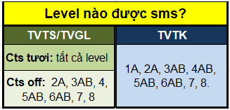

# 2.8.Check SMS

### Quy định về tạo và gửi sms

#### 1.Level nào được sms?

#### 2.Nội dung sms yêu cầu gì?

|  |  |
| :--- | :--- |
| Nội dung | Cập nhật ưu đãi, Tên trung tâm, không có từ cấm |
| SL ký tự | Thường &lt;=160 |

### Quy trình check sms

Bước 1. Tìm nguyên nhân **SMS gửi không thành công**

* Từ cấm
* Nhà mạng
* Định dạng có dấu/không dấu
* ...?

Bước 2. Check SMS gửi thành công

* Nội dung đúng/sai? Tên TVTS? - Tên + Địa chỉ Cơ sở SM?
* SL ký tự có quá nhiều?
* 
