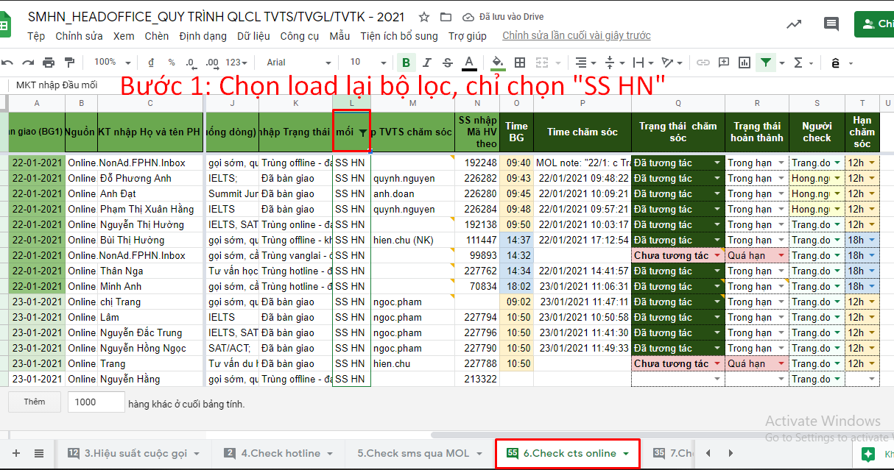
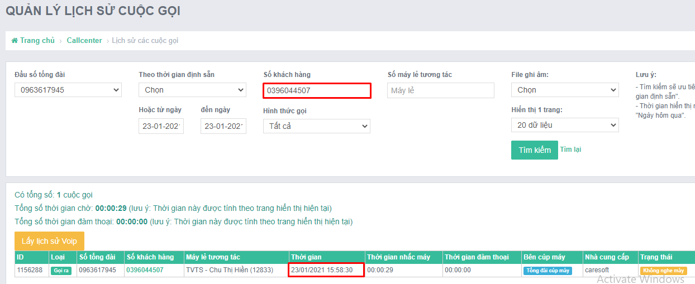
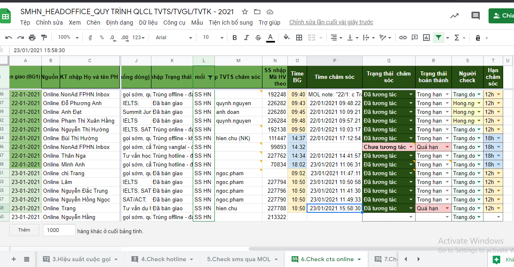

# 2.6. Check cts online

### Bước 1. Chọn load lại bộ lọc, chỉ chọn "SS HN"

### Bước 2: Copy sdt của PH/HV vào Quản lý lịch sử cuộc gọi, tương tự như check hotline

### Bước 3: Paste lịch sử cuộc gọi vào ô "Time chăm sóc", tương tự nhue check hotline

Bước 4: Điền kết quả

* Chưa tương tác/Đã tương tác
* Trong hạn/Quá hạn. Quy định về hạn xử lý:

| Thời gian bàn giao | Hạn xử lý |
| :--- | :--- |
| Trước 11h00 | 12h00 |
| Sau 11h00 | 18h00 |

