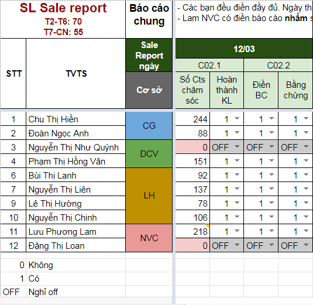
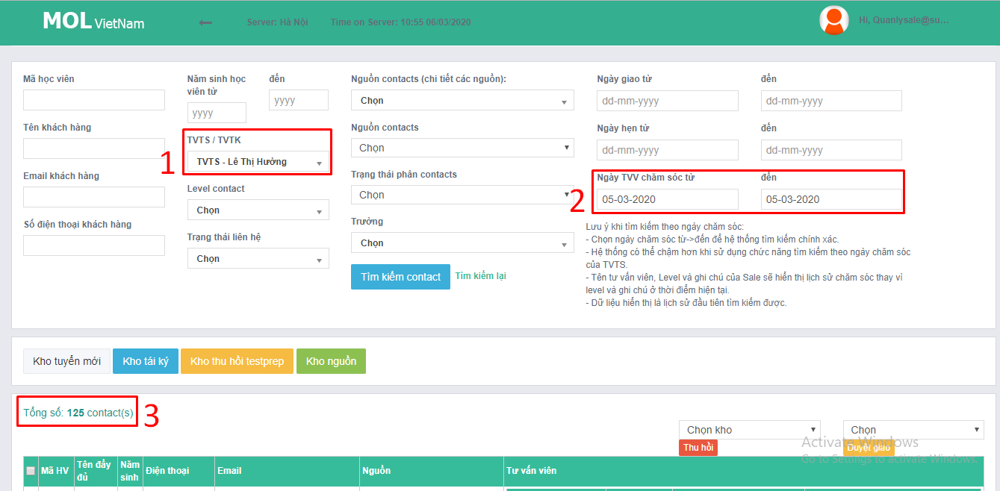
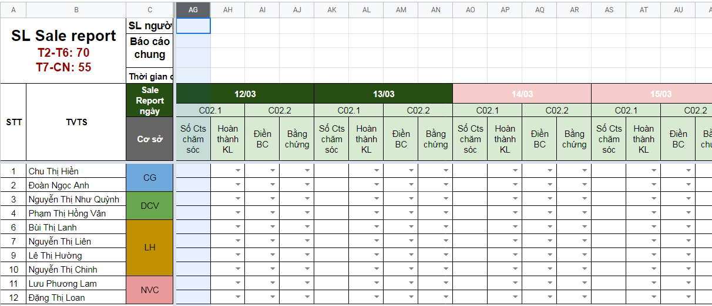

# 2.Check Sale Report C02

**Bước 1**. Mở song song 2 file đầu tiên để đối chiếu

* **BC khối lượng** công việc theo ngày: [http://bit.ly/2Te5Bpi](http://bit.ly/32L6M2u)
* **Bằng chứng:** [http://bit.ly/2Tehfk8](http://bit.ly/2Tehfk8)
* Form báo cáo lỗi: [http://bit.ly/39zZ1yM](http://bit.ly/39zZ1yM)
* Lịch nghỉ off: 

**Bước 2.** Kiểm tra kết quả. Điền báo cáo tại link: [http://bit.ly/2SQ](http://bit.ly/2SQFLGm)

Có các loại kết quả sau:

* Không hoàn thành khối lượng cv --&gt; **C02.1**
* Không viết báo cáo + lưu bằng chứng --&gt; **C02.2**
* Không có cả hai  --&gt; combo luôn
* Nghỉ off

## **\*Mẹo**

**\*Mẹo 1. Check Sale report nhanh, chính xác**

* Điền nghỉ off fulltime --&gt; Mở bằng chứng, xem số liệu --&gt; Check báo cáo, phần số cts chăm sóc, sau đó lướt lên trên xem điền đủ các L1-L6.. chưa --&gt; Điền vào báo cáo cá nhân. 

**\*Mẹo 2. Nếu bạn không điền báo cáo \(kèm bằng chứng\) thì sao biết bạn có hoàn thành khối lượng công việc hay không?**

Vào CRM kiểm tra. Tuy nhiên lưu ý kết quả CRM thể hiện là tính toàn bộ số lượt chăm sóc của 1 Cts trong ngày nên sẽ chênh lệch với số lượng cần báo cáo là **số cts được chăm sóc**/ngày.

**\*Mẹo 3. Hạn chế rủi ro check Sale Report sai khối lượng ngày trong tuần/cuối tuần**

* Đầu tuần tạo trước khung báo cáo các ngày
* Tô màu hồng cho T7 và CN. Có thể tạo thêm xác thực dữ liệu - cảnh báo về khối lượng, tuy nhiên không thực sự cần thiết, làm nặng file vì thông thường khối lượng đều đạt trên mức tiêu chuẩn\)

