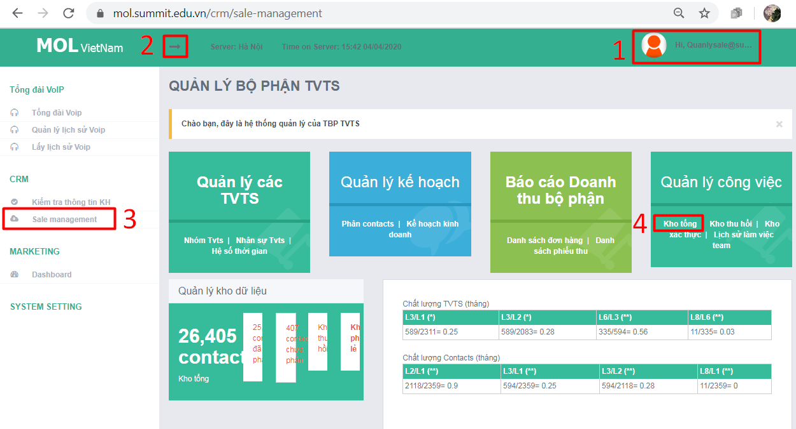
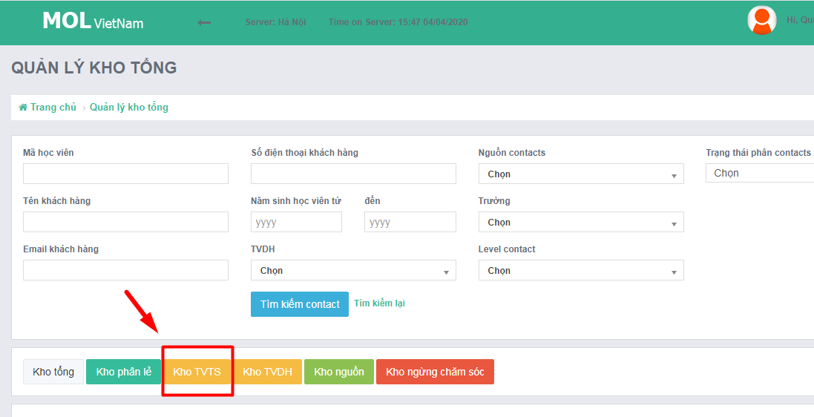
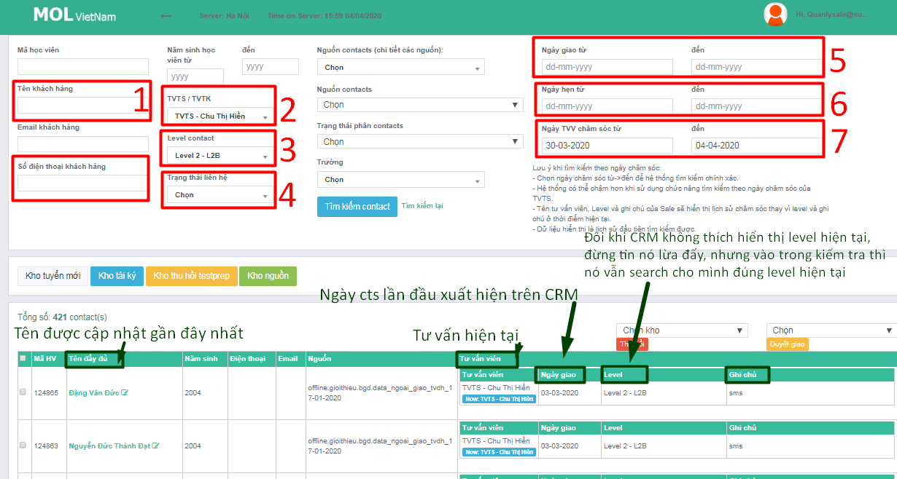

# 2.Quy trình KSCL

## **Giới thiệu chung**

### **Các công cụ:**

* Form báo cáo lỗi. Link: [https://t.ly/ac5y](https://t.ly/ac5y)
* Phần mềm quản lý DL: [https://mol.summit.edu.vn](https://mol.summit.edu.vn)
* Tài khoản CRM QLCL : quanlysale@summit.edu.vn
* Tài khoản Email QLCL: storage.tvts@summit.edu.vn
* **BC dữ liệu QLCL**: [https://t.ly/Rr0G](https://t.ly/Rr0G)

### **HƯỚNG DẪN CHUNG TRUY CẬP CRM**

**Bước 1-2-3-4:** Đăng nhập bằng TK KSCL/Đảo chiều mũi tên/Sale Manager/Kho tổng

**Bước 5:** Vào Kho TVTS

* 5,6,7 **có** thể cùng nhau xuất hiện
* 4 cho phép lọc "nghe máy", "không liên lạc được", ...
* Để biết tác dụng của các bộ lọc --&gt; đi vào QT KSCL cụ thể dưới đây nhé!

