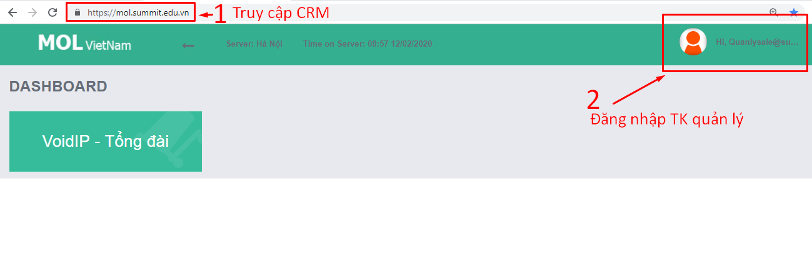
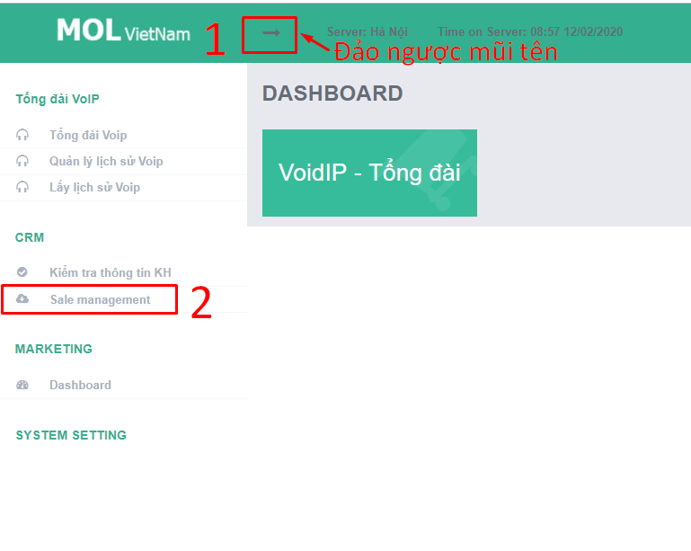
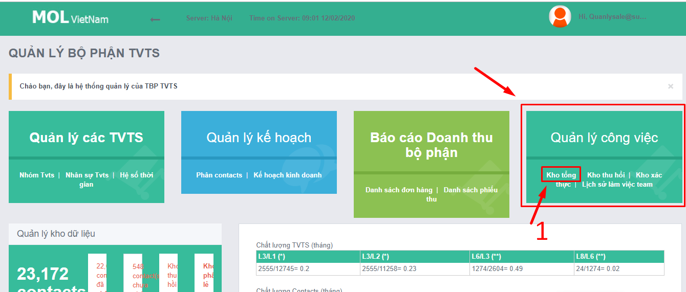
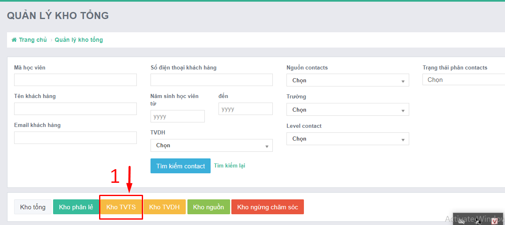

# 2.Quy trình KSCL

## **Giới thiệu chung**

### **Các công cụ:**

* Form báo cáo lỗi. Link: [https://forms.gle/Zc3fYdTbrqqwsd5G7](https://forms.gle/Zc3fYdTbrqqwsd5G7)
* Email QLCL: storage.tvts@summit.edu.vn
* Tài khoản QLCL tại phần mềm CRM: [https://mol.summit.edu.vn/](https://mol.summit.edu.vn/) 

### **HƯỚNG DẪN CHUNG TRUY CẬP CRM**

|  |  |
| :--- | :--- |

| Bước 1 |  |
| :--- | :--- |

| Bước 2 |  |
| :--- | :--- |

| Bước 3 |  |
| :--- | :--- |

| Bước 4 |  |
| :--- | :--- |

<table>
  <thead>
    <tr>
      <th style="text-align:left">B&#x1B0;&#x1EDB;c 5</th>
      <th style="text-align:left">
        
T&#xF9;y theo y&#xEA;u c&#x1EA7;u ki&#x1EC3;m tra m&#xE0; l&#x1EF1;a ch&#x1ECD;n
          b&#x1ED9; l&#x1ECD;c.

        
D&#x1B0;&#x1EDB;i &#x111;&#xE2;y l&#xE0; h&#x1B0;&#x1EDB;ng d&#x1EAB;n
          c&#x1A1; b&#x1EA3;n v&#x1EC1; c&#xE1;ch b&#x1ED9; l&#x1ECD;c ho&#x1EA1;t
          &#x111;&#x1ED9;ng:

      </th>
    </tr>
  </thead>
  <tbody></tbody>
</table>| Yêu cầu kiểm tra/tra cứu | Sử dụng điều kiện lọc |
| :--- | :--- |

| Tìm học viên | 1 + 2 \(nếu có quá nhiều HV trùng tên\) |
| :--- | :--- |

<table>
  <thead>
    <tr>
      <th style="text-align:left">Ki&#x1EC3;m tra t&#x1ED3;n c&#x1EE7;a TVTS</th>
      <th style="text-align:left">
        
2 + 6

        
(&#x110;&#x1EBF;n ng&#xE0;y &#x111;&#xE3; h&#x1EB9;n v&#x1EDB;i HV th&#xEC;
          TVTS c&#x1EA7;n ch&#x103;m s&#xF3;c.

        
N&#x1EBF;u kh&#xF4;ng ch&#x103;m s&#xF3;c th&#xEC; t&#xED;nh l&#xE0; &quot;t&#x1ED3;n&quot;)

      </th>
    </tr>
  </thead>
  <tbody></tbody>
</table><table>
  <thead>
    <tr>
      <th style="text-align:left">V&#x1EDB;i c&#xE1;c <b>cts &#x111;&#x1B0;&#x1EE3;c giao</b> trong tu&#x1EA7;n,
         <b>TVTS X</b> &#x111;&#xE3; ch&#x103;m s&#xF3;c ntn v&#x1EDB;i t&#x1EEB;ng <b>level</b>
      </th>
      <th style="text-align:left">
        
5 + 2 + 3

        
(H&#x1EB1;ng ng&#xE0;y TVTS s&#x1EBD; <b>&#x111;&#x1B0;&#x1EE3;c giao</b> th&#xEA;m
          cts v&#xE0;
           ch&#x103;m s&#xF3;c l&#x1EA1;i c&#xE1;c cts m&#xE0; m&#xEC;nh &#x111;&#xE3;
          h&#x1EB9;n tr&#x1B0;&#x1EDB;c &#x111;&#xF3;)

      </th>
    </tr>
  </thead>
  <tbody></tbody>
</table>| Với các **cts đã chăm sóc** trong tuần, **TVTS X** đã chăm sóc ntn với từng **level** | 7 + 2 + 3 |
| :--- | :--- |

* Nghe máy
* Không nhấc máy
* Không liên lạc được
* Sai số

