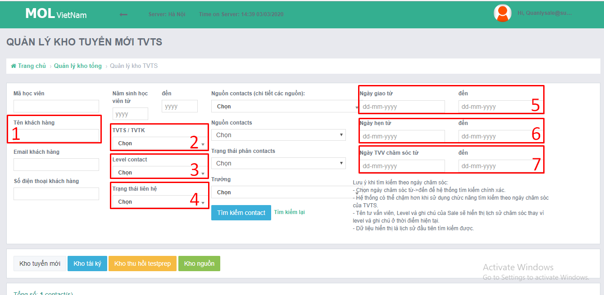

# 2.Quy trình KSCL

### **Giới thiệu chung**

#### **Các công cụ:** 

* Form báo cáo lỗi. Link: [https://forms.gle/Zc3fYdTbrqqwsd5G7](https://forms.gle/Zc3fYdTbrqqwsd5G7)
* Email QLCL: storage.tvts@summit.edu.vn
* Tài khoản QLCL tại phần mềm CRM: [https://mol.summit.edu.vn/](https://mol.summit.edu.vn/) 

#### **HƯỚNG DẪN CHUNG TRUY CẬP CRM**

<table>
  <thead>
    <tr>
      <th style="text-align:left"></th>
      <th style="text-align:left"></th>
    </tr>
  </thead>
  <tbody>
    <tr>
      <td style="text-align:left">B&#x1B0;&#x1EDB;c 1</td>
      <td style="text-align:left">
        
      </td>
    </tr>
    <tr>
      <td style="text-align:left">B&#x1B0;&#x1EDB;c 2</td>
      <td style="text-align:left">
        
      </td>
    </tr>
    <tr>
      <td style="text-align:left">B&#x1B0;&#x1EDB;c 3</td>
      <td style="text-align:left">
        
      </td>
    </tr>
    <tr>
      <td style="text-align:left">B&#x1B0;&#x1EDB;c 4</td>
      <td style="text-align:left">
        
      </td>
    </tr>
    <tr>
      <td style="text-align:left">B&#x1B0;&#x1EDB;c 5</td>
      <td style="text-align:left">
        
T&#xF9;y theo y&#xEA;u c&#x1EA7;u ki&#x1EC3;m tra m&#xE0; l&#x1EF1;a ch&#x1ECD;n
          b&#x1ED9; l&#x1ECD;c.

        
D&#x1B0;&#x1EDB;i &#x111;&#xE2;y l&#xE0; h&#x1B0;&#x1EDB;ng d&#x1EAB;n
          c&#x1A1; b&#x1EA3;n v&#x1EC1; c&#xE1;ch b&#x1ED9; l&#x1ECD;c ho&#x1EA1;t
          &#x111;&#x1ED9;ng:

      </td>
    </tr>
  </tbody>
</table>

<table>
  <thead>
    <tr>
      <th style="text-align:left">Y&#xEA;u c&#x1EA7;u ki&#x1EC3;m tra/tra c&#x1EE9;u</th>
      <th style="text-align:left">S&#x1EED; d&#x1EE5;ng &#x111;i&#x1EC1;u ki&#x1EC7;n l&#x1ECD;c</th>
    </tr>
  </thead>
  <tbody>
    <tr>
      <td style="text-align:left">T&#xEC;m h&#x1ECD;c vi&#xEA;n</td>
      <td style="text-align:left">1 + 2 (n&#x1EBF;u c&#xF3; qu&#xE1; nhi&#x1EC1;u HV tr&#xF9;ng t&#xEA;n)</td>
    </tr>
    <tr>
      <td style="text-align:left">Ki&#x1EC3;m tra t&#x1ED3;n c&#x1EE7;a TVTS</td>
      <td style="text-align:left">
        
2 + 6

        
(&#x110;&#x1EBF;n ng&#xE0;y &#x111;&#xE3; h&#x1EB9;n v&#x1EDB;i HV th&#xEC;
          TVTS c&#x1EA7;n ch&#x103;m s&#xF3;c.

        
N&#x1EBF;u kh&#xF4;ng ch&#x103;m s&#xF3;c th&#xEC; t&#xED;nh l&#xE0; &quot;t&#x1ED3;n&quot;)

      </td>
    </tr>
    <tr>
      <td style="text-align:left">V&#x1EDB;i c&#xE1;c <b>cts &#x111;&#x1B0;&#x1EE3;c giao</b> trong tu&#x1EA7;n,
         <b>TVTS X </b>&#x111;&#xE3; ch&#x103;m s&#xF3;c ntn v&#x1EDB;i t&#x1EEB;ng<b> level</b>
      </td>
      <td style="text-align:left">
        
5 + 2 + 3

        
(H&#x1EB1;ng ng&#xE0;y TVTS s&#x1EBD; <b>&#x111;&#x1B0;&#x1EE3;c giao</b> th&#xEA;m
          cts v&#xE0;
           ch&#x103;m s&#xF3;c l&#x1EA1;i c&#xE1;c cts m&#xE0; m&#xEC;nh &#x111;&#xE3;
          h&#x1EB9;n tr&#x1B0;&#x1EDB;c &#x111;&#xF3;)

      </td>
    </tr>
    <tr>
      <td style="text-align:left">V&#x1EDB;i c&#xE1;c <b>cts &#x111;&#xE3; ch&#x103;m s&#xF3;c</b> trong tu&#x1EA7;n,
         <b>TVTS X</b> &#x111;&#xE3; ch&#x103;m s&#xF3;c ntn v&#x1EDB;i t&#x1EEB;ng <b>level</b>
      </td>
      <td style="text-align:left">7 + 2 + 3</td>
    </tr>
  </tbody>
</table>Ngoài ra, ô số 4 cho phép lọc theo các trạng thái cuộc gọi là: 

* Nghe máy
* Không nhấc máy
* Không liên lạc được
* Sai số

