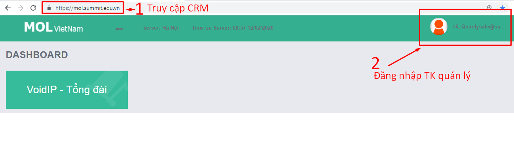
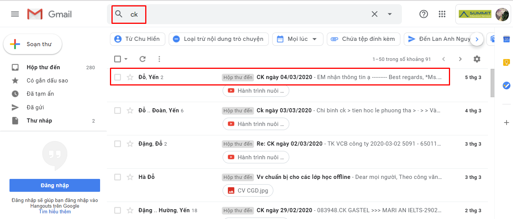

# 2.4.Check email

### 3.1. Check Số lượng email

**Bước 1.** Từ file hứng SS điền Copy tên HV **đến hạn chót** [http://bit.ly/398VuHP](http://bit.ly/398VuHP)

File QL tư vấn 1-1: [https://bit.ly/2zEqVgF](https://bit.ly/2zEqVgF)

**Bước 2.** Paste tại ô Tìm kiếm "chính xác" trong hòm thư storage.tvts@summit.edu.vn

**Bước 3.** Điền kết quả 

<table>
  <thead>
    <tr>
      <th style="text-align:left"></th>
      <th style="text-align:left"></th>
    </tr>
  </thead>
  <tbody>
    <tr>
      <td style="text-align:left"><b>1</b>
      </td>
      <td style="text-align:left">Ca&#x301;c case &#x111;a&#x303; check xong c&#xE2;&#x300;n &#x111;&#x1B0;&#x1A1;&#x323;c
        t&#xF4; va&#x300;ng</td>
    </tr>
    <tr>
      <td style="text-align:left">2</td>
      <td style="text-align:left">
        
&quot;Ha&#x323;n g&#x1B0;&#x309;i email&quot;. Trong vo&#x300;ng 3 nga&#x300;y,
          sau khi HV l&#xEA;n Test (th&#x1B0;&#x1A1;&#x300;ng tru&#x300;ng nga&#x300;y
          co&#x301; k&#xEA;&#x301;t qua&#x309; ch&#xE2;&#x301;m ba&#x300;i cu&#x309;a
          GV), TVTS th&#x1B0;&#x323;c hi&#xEA;&#x323;n cu&#xF4;&#x323;c go&#x323;i
          tra&#x309; k&#xEA;&#x301;t qua&#x309;. Khi th&#x1B0;&#x323;c hi&#xEA;&#x323;n
          cu&#xF4;&#x323;c go&#x323;i thi&#x300; co&#x301; ca&#x301;c k&#xEA;&#x301;t
          qua&#x309; sau:

        
TH1: Li&#xEA;n la&#x323;c &#x111;&#x1B0;&#x1A1;&#x323;c, th&#xF4;&#x301;ng
          nh&#xE2;&#x301;t &#x111;&#x1B0;&#x1A1;&#x323;c ph&#x1B0;&#x1A1;ng a&#x301;n
          v&#x1A1;&#x301;i PH --&gt; G&#x1B0;&#x309;i k&#xEA;&#x301;t qua&#x309;
          qua email ngay trong nga&#x300;y go&#x323;i &#x111;i&#xEA;&#x323;n.

        
TH2: Li&#xEA;n la&#x323;c &#x111;&#x1B0;&#x1A1;&#x323;c, nh&#x1B0;ng ch&#x1B0;a
          th&#xF4;&#x301;ng nh&#xE2;&#x301;t &#x111;&#x1B0;&#x1A1;&#x323;c ph&#x1B0;&#x1A1;ng
          a&#x301;n, he&#x323;n go&#x323;i la&#x323;i sau... --&gt; Note la&#x323;i
          ly&#x301; do ch&#xE2;&#x323;m g&#x1B0;&#x309;i email trong CRM va&#x300;
          g&#x1B0;&#x309;i email tra&#x309; k&#xEA;&#x301;t qua&#x309; s&#x1A1;&#x301;m
          nh&#xE2;&#x301;t co&#x301; th&#xEA;&#x309;.

        
TH3: KLLD trong vo&#x300;ng 3 nga&#x300;y --&gt; V&#xE2;&#x303;n g&#x1B0;&#x309;i
          email tra&#x309; k&#xEA;&#x301;t qua&#x309;

        
<b>&gt;&gt;L&#xF4;&#x303;i M01.1: </b>Ch&#x1B0;a g&#x1B0;&#x309;i - Qua&#x301;
          ha&#x323;n (ca&#x309;nh ba&#x301;o, nh&#x103;&#x301;c nh&#x1A1;&#x309;)

        
<b>&gt;&gt;L&#xF4;&#x303;i M01.2: </b>&#x110;a&#x303; g&#x1B0;&#x309;i
          - Qua&#x301; ha&#x323;n (BP QLCL l&#x1B0;u y&#x301; theo do&#x303;i sa&#x301;t
          sao h&#x1A1;n, tra&#x301;nh &#x111;&#xEA;&#x309; TH na&#x300;y xa&#x309;y
          ra)

      </td>
    </tr>
    <tr>
      <td style="text-align:left">3</td>
      <td style="text-align:left">&#x110;&#xEA;&#x309; m&#x103;&#x323;c &#x111;i&#x323;nh la&#x300; &quot;ch&#x1B0;a
        g&#x1B0;&#x309;i&quot; vi&#x300; ch&#x1B0;a ki&#xEA;&#x309;m tra. Sau khi
        ki&#xEA;&#x309;m tra thi&#x300; cho&#x323;n k&#xEA;&#x301;t qua&#x309;.
        KAD cho m&#xF4;&#x323;t s&#xF4;&#x301; ba&#x300;i Test kh&#xF4;ng thu&#xF4;&#x323;c
        pha&#x323;m vi tra&#x301;ch nhi&#xEA;&#x323;m qua&#x309;n ly&#x301; cu&#x309;a
        BP</td>
    </tr>
    <tr>
      <td style="text-align:left">4</td>
      <td style="text-align:left">Ca&#x301;c email c&#xE2;&#x300;n g&#x1B0;&#x309;i qua&#x309;n ly&#x301;
        sale ki&#xEA;&#x309;m tra/&#x111;&#xF4;n &#x111;&#xF4;&#x301;c TVTS th&#x1B0;&#x323;c
        hi&#xEA;&#x323;n thi&#x300; c&#xE2;&#x300;n theo do&#x303;i qua&#x301;
        tri&#x300;nh gia&#x309;i quy&#xEA;&#x301;t</td>
    </tr>
  </tbody>
</table>

**Bước 4. Bôi vàng**

Để hạn chế phần nào rủi ro bị xóa hàng từ file hứng

**Mẹo:** Liên tục check email mới đến thay vì copy paste chính xác tên học viên Test sẽ giúp kiểm soát gần như tối đa các rủi ro do SS/TVTS gõ sai tên HV. Tuy nhiên việc TVTS không CC sang hòm thư tổng thì không kiểm soát được

### 3.2. Check chất lượng email

**Bước 1:** Vào hòm thư Storage để xem **những** email trả kết quả gần nhất. 

* Nếu không có --&gt; Bỏ qua
* Nếu có --&gt; Kiểm tra chất lượng email theo yêu cầu ở phần "Cơ chế thẻ xanh - đỏ" và điền "Đã gửi" tại form theo dõi email trên. 

**Bước 2**: Check chất lượng email kèm check cuộc gọi 6AB + 3A \(nếu có\)

* Điền kết quả vào form: [http://bit.ly/39zZ1yM](http://bit.ly/39zZ1yM)

### 3.3. Check email L8

**Bước 1.** Từ email chuyển khoản học phí, có tiêu đề **"CK...."**

**Bước 2.** Tìm theo tên học viên và sale, để kiểm tra TVTS đã gửi email xác nhận học phí và gửi **"cam kết chất lượng"** hay chưa?

**Bước 3**. Điền báo cáo

