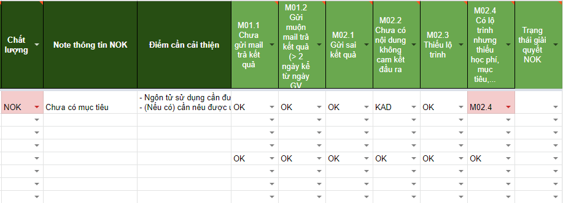

# 3.2.Check CL email

\(như màu sắc, bảng biểu, thiếu nội dung ...\)

**Mục tiêu trả lời câu hỏi:** Nội dung email mà TVTS gửi có đầy đủ, chính xác so với email của GV trả điểm hay chưa?

**Điền kết quả công việc**: [http://bit.ly/398VuHP](http://bit.ly/398VuHP)

### Quy định chất lượng email

Nội dung cần check:

Ngoài các tiêu chí trên, cần check thêm các nội dung sau:

### **1. Sử dụng ngôn từ** 

**Xưng hô** đồng nhất.  
- **Gộp ý và sử dụng cấu trúc câu ghép**/câu phức nếu gặp câu quá ngắn.  
- Soát **chính tả** cẩn thận.  
- Chú ý sử dụng phù hợp về mặt ngữ nghĩa của câu, dùng các **từ nối** cho hợp lý.  
- Với các từ mang ý nghĩa tiêu cực/quá nặng cần sử dụng các **từ ngữ giảm nhẹ hơn** và mang tính lịch sự nhưng cơ bản giữ được ý nghĩa cần truyền tải.

### **2. Thời gian học:**

* Bổ sung thời gian học **không bao gồm nghỉ lễ tết**

### **3. Khi nào cần "Không cam kết đầu ra"**

* Không cam kết đầu ra khi TVTS xin VỚT \(không phải là GV cho phép vớt\) --&gt; rất hiếm khi xảy ra

### **4. Khi nào cần gửi "Cam kết chất lượng"**

* Level 8 \(sau khi HV hoàn thành 100% học phí\) - TVTS cần gửi email xác nhận kèm **nội quy học tập** trước khi ngày khóa học bắt đầu

### **5. Email mẫu?**

[https://mail.google.com/mail/u/0/\#label/%C4%90%C3%A0o+Li%C3%AAn/FMfcgxwHMGFjDdFWPwcblZdhHMnGgcXq](https://mail.google.com/mail/u/0/#label/%C4%90%C3%A0o+Li%C3%AAn/FMfcgxwHMGFjDdFWPwcblZdhHMnGgcXq)

