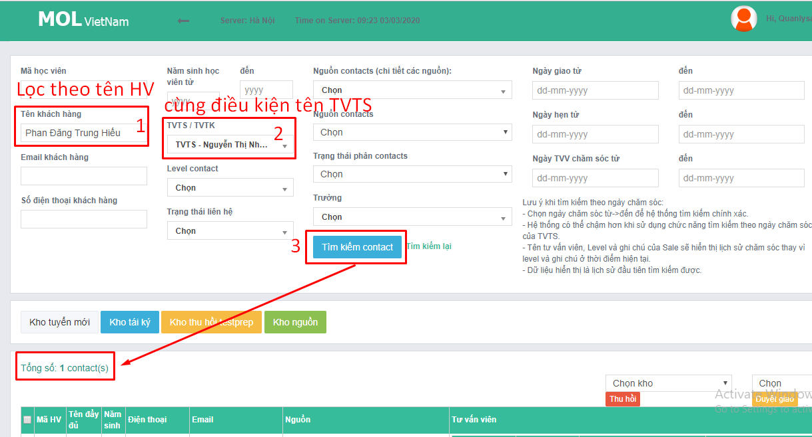

# 3.1.Check SL email

**Có 2 cách check email:** Check xuôi từ DS SS, check ngược từ email.

### **Cách 1**

Từ Danh sách HV lên test của Sale Suport

| \*\*\*\* |  |
| :--- | :--- |
| Bước 1. Copy tên HV từ Danh sách HV lên Test của SS | [http://bit.ly/2HmVwjf](http://bit.ly/2HmVwjf) |
| Bước 2. Paste tên HV vào hòm thư Storage  |   |

<table>
  <thead>
    <tr>
      <th style="text-align:left">K&#x1EBF;t qu&#x1EA3; s&#x1A1; b&#x1ED9;</th>
      <th style="text-align:left">K&#x1EBF;t qu&#x1EA3; chi ti&#x1EBF;t</th>
    </tr>
  </thead>
  <tbody>
    <tr>
      <td style="text-align:left">
        
<b>&#x110;&#xE3; g&#x1EED;i --&gt; Ki&#x1EC3;m tra th&#x1EDD;i gian g&#x1EED;i</b>
        

        

          
        

      </td>
      <td style="text-align:left">
        
<b>1-</b>G&#x1EED;i trong th&#x1EDD;i gian quy &#x111;&#x1ECB;nh

        
<b>2-</b>G&#x1EED;i ngo&#xE0;i th&#x1EDD;i gian quy &#x111;&#x1ECB;nh
          (*)

      </td>
    </tr>
    <tr>
      <td style="text-align:left">
        
<b>Ch&#x1B0;a g&#x1EED;i --&gt; Ki&#x1EC3;m tra Level</b>
        

        

          
        

        

          
        

      </td>
      <td style="text-align:left">
        
<b>1-</b>&#x110;&#xE3; l&#xEA;n level 6. C&#xF3; 2 tr&#x1B0;&#x1EDD;ng
          h&#x1EE3;p: TH1. Qu&#xEA;n CC
           TH2. Ghi sai t&#xEA;n HV --&gt; <b>Ki&#x1EC3;m tra d&#x1EF1;a tr&#xEA;n email g&#x1EED;i t&#x1EEB; TVTS</b>
        

        
<b>2-</b>Ch&#x1B0;a l&#xEA;n level 6 c&#xF3; 2TH:

        
+ Trong v&#xF2;ng 4 ng&#xE0;y --&gt; h&#x1EE3;p l&#x1EC7;

        
+ Sang ng&#xE0;y th&#x1EE9; 5 --&gt; kh&#xF4;ng h&#x1EE3;p l&#x1EC7; (*)

        

        

      </td>
    </tr>
  </tbody>
</table>

* Ở bước 5, nếu thấy khó khăn trong việc tìm ra đúng HV khi xuất hiện rất nhiều kết quả, bạn có thể làm như sau:

\(\*\) Tăng tần suất check email thành **check hằng ngày** để đảm bảo trường hợp này không xảy ra và TVTS được cảnh báo sớm - trong thời gian quy định. 

### **Cách 2**

Check ngược. Từ label "trả kết quả", thấy xuất hiện email của HV nào thì báo cáo là đã trả. các trường hợp "chưa trả" --&gt; check CRM kiểm tra xem vì sao chưa trả 

* quá 5 ngày chưa trả --&gt; không hợp lệ
* trong vòng 4 ngày chưa gọi được --&gt; hợp lệ
* đã lên level 6 --&gt; quên cc

**\*Rủi ro:** 

* Phải đọc, nhớ và gõ lại tên của HV được trả kết quả để tìm kiếm trong file của SS
* Cách này chỉ áp dụng được từ thời điểm việc check xuôi hoàn thành 100%
* Có email trả kết quả rồi nhưng không dán label
* Tên HV trong email không trùng với tên SS ghi, thì phải tìm thủ công
* TVTS trả kết quả nhưng không dán nhãn label

--&gt; Giải quyết rủi ro: Chỉ sử dụng Cách 2.check ngược khi Cách 1 gặp trục chặc là "không tìm thấy tên HV" 

**??** Chưa chắc dùng cách 2 này vì ngốn thời gian hơn và không giải quyết được rủi ro của cách 1

