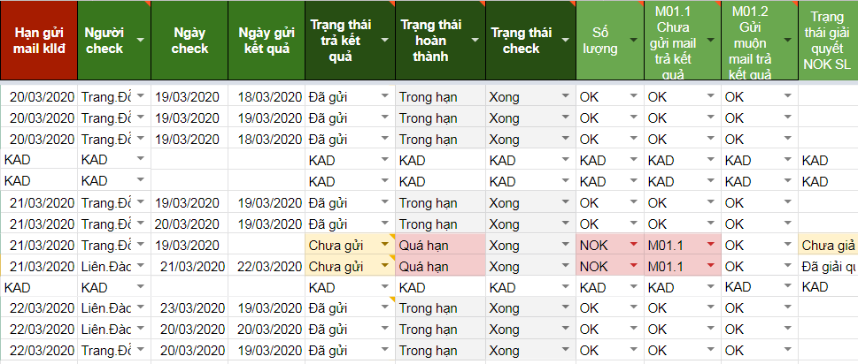

# 3.Check email

## 1. Check email nào?

Tại nguồn học viên

* Bỏ check email: 1-1,Fulltest 1-1,TVDH,ACT,CSHV,TVTDH
* Chọn check email: SAT, đã có hẹn TVTS/TVTK,Giới thiệu,gọi lọc,hotline,vãng lại, nguồn khác,Fulltest của TVTS

## 2. Cần tài liệu gì để check email?

* Đăng nhập CRM với TK Quản lý Sale: [https://mol.summit.edu.vn](https://mol.summit.edu.vn)
* Hòm thư Quản lý sale: storage.tvts@summit.edu.vn
* **Báo cáo Excel**: [http://bit.ly/2HmVwjf](http://bit.ly/398VuHP)
* Form báo cáo lỗi: [http://bit.ly/39zZ1yM](http://bit.ly/39zZ1yM)

## 3. Mục đích check email

* **Cảnh báo** hàng ngày \(buổi trưa\) với các email _đến hạn chót_ gửi
* **Nội dung email** trả kết quả có đáp ứng được nhu cầu của KH?

## \*Mẹo:

* Mục tiêu 1. Cảnh báo các email đến hạn chót cần gửi trong ngày --&gt; Check trước buổi trưa và chỉ check email có _ngày check_ trùng _ngày hạn chót_
* Mục tiêu 2. Kiểm soát số lượng/chất lượng email --&gt; Check vào giữa buổi chiều, khi có nhu cầu chấm 6A/3A. Lý do: Tự bản thân TVTS thường có sẵn 1 file theo dõi HV tiềm năng, cần ưu tiên chăm sóc, Tự bản thân TVTS cũng không muốn vi phạm lỗi nên đa phần các bạn đều tự giác/chủ động gửi email, việc cảnh báo sớm đôi khi là không cần thiết.
* Việc check email _**nhiều lần**_ trong ngày từ file hứng SS điền không mang lại nhiều hiệu quả. Thay vào đó hãy check email Storage để thấy ngay các email nào vừa đến \(do CC\) sẽ tối ưu thời gian hơn. 

## 4. Quy định về gửi emai

### 4.1. Quy định về thời gian gửi \(số lượng email\)

Ngay **trong ngày** GV trả kết quả, TVTS cần thực hiện "Cuộc gọi trả kết quả" ngay và gửi email ngay sau đó.

**\*Lưu ý:**

* Nếu liên tục **3** ngày từ khi HV lên Test, TVST không liên lạc được thì sang ngày thứ **4** vẫn phải gửi email.
* Nếu TVTS nghỉ off ngày mà GV trả kết quả thì ngay ngày đầu tiên đi làm phải trả kết quả luôn.Nếu TVTS nghỉ dài ngày thì liên lạc ngay với quản lý.
* Email gửi đi cần CC cho Storage để được xác nhận là đã gửi

### 4.2. Quy định về nội dung gửi \(chất lượng email\)

Email gửi đi cần có nội dung chính xác, thông tin đầy đủ _\(xem tại mục 3.2\)_

## 5. Kế hoạch

* Check hàng ngày.
* Check hết số lượng email --&gt; Check chất lượng email

\(**RỦI RO: COPY, PASTE, ENTER Ở MOL:** Thay thế, biến mất tên HV\)

## \*\*\*\*

