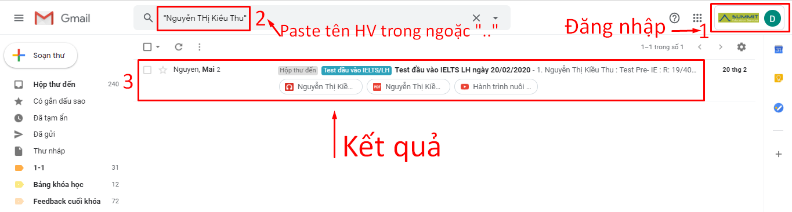

# 2.7.Check email

### Cách check email theo chiều mới:

* Lọc điều kiện: "Từ email của TV..."
* Xem có email được in đậm - chưa check
* Nhìn xem HV tương ứng với sheet hứng dữ liệu để check SL và CL

| Rủi ro của cách check này:                                                             | --> Bổ sung thao tác sau để khắc phục              |
| -------------------------------------------------------------------------------------- | -------------------------------------------------- |
| TV khác gửi hộ thì check email từ TV gốc sẽ không ra                                   | Check theo tên HV. Cho dấu ngoặc kép. VD: "..."    |
| TV vừa gửi nhưng hòm mail chung storage đã có người mở ra nên mail đó không hiện đậm   | Check theo tên HV. Cho dấu ngoặc kép. VD: "..."    |
| GV yêu cầu Test lại nhưng MOL cũng không cập nhật nội dung này, vẫn để level 5,6 gì đó | Check kết quả Test trong luồng mail phối hợp SS-GV |

###

### Lưu ý:

Với các email chưa gửi cần check thực sự là chưa gửi thật hay không. 

| Cách check theo                           | Quản lý rủi ro                                                                                           |
| ----------------------------------------- | -------------------------------------------------------------------------------------------------------- |
| Tên chính xác của HV                      | Tìm thấy nhanh nhất                                                                                      |
| Email của HV và PH                        | Tên HV trên tiêu đề không chính xác/không trùng với SS ghi                                               |
| Email gửi từ TVTS                         | PHHS thay email mới để nhận kết quả/Tên HV sai... --> Cách này khá tối ưu, nhưng mất nhiều thời gian hơn |
| MOL, quá trình chăm sóc note đã gửi email | quên CC                                                                                                  |

1-Check hết email đã gửi

2-Chuyển sang email chưa gửi: Lý do vì sao chưa gửi? Hợp lệ hay không? GV chấm bài ngày nào để xem đúng là **sắp đến hạn thật chưa hay cần thay đổi hạn**? - Xóa hàm - thay đổi hạn

3-Tháo bộ lọc kiểm tra xem có sót case nào không

### 3.1. Check Số lượng email

**Bước 1. **Từ file hứng SS điền Copy tên HV **đến hạn chót **[http://bit.ly/398VuHP](http://bit.ly/398VuHP)

**File QL tư vấn 1-1**: [https://bit.ly/2zEqVgF](https://bit.ly/2zEqVgF)

File GenMath Test: [https://docs.google.com/spreadsheets/d/1H4orTkzJ_G2ErxbNQr-iT7CqAJNC-71VMIzuDIGcR5Q/edit#gid=850857682](https://docs.google.com/spreadsheets/d/1H4orTkzJ_G2ErxbNQr-iT7CqAJNC-71VMIzuDIGcR5Q/edit#gid=850857682)

**Bước 2. **Paste tại ô Tìm kiếm "chính xác" trong hòm thư storage.tvts@summit.edu.vn

**Bước 3.** Điền kết quả 

.png>)

|       |                                                                                                                                                                                                                                                                                                                                                                                                                                                                                                                                                                                                                                                                                                                                                                                                                                                      |
| ----- | ---------------------------------------------------------------------------------------------------------------------------------------------------------------------------------------------------------------------------------------------------------------------------------------------------------------------------------------------------------------------------------------------------------------------------------------------------------------------------------------------------------------------------------------------------------------------------------------------------------------------------------------------------------------------------------------------------------------------------------------------------------------------------------------------------------------------------------------------------- |
| **1** | Các case đã check xong cần được tô xanh                                                                                                                                                                                                                                                                                                                                                                                                                                                                                                                                                                                                                                                                                                                                                                                                          |
| 2     | 
"Hạn gửi email". Trong vòng 3 ngày, sau khi HV lên Test (thường trùng ngày có kết quả chấm bài của GV), TVTS thực hiện cuộc gọi trả kết quả. Khi thực hiện cuộc gọi thì có các kết quả sau:

TH1: Liên lạc được, thống nhất được phương án với PH --> Gửi kết quả qua email ngay trong ngày gọi điện.

TH2: Liên lạc được, nhưng chưa thống nhất được phương án, hẹn gọi lại sau... --> Note lại lý do chậm gửi email trong CRM và gửi email trả kết quả sớm nhất có thể.

TH3: KLLD trong vòng 3 ngày --> Vẫn gửi email trả kết quả

<strong>>>Lỗi M01.1: </strong>Chưa gửi - Quá hạn (cảnh báo, nhắc nhở) 

<strong>>>Lỗi M01.2: </strong>Đã gửi - Quá hạn (BP QLCL lưu ý theo dõi sát sao hơn, tránh để TH này xảy ra)
 |
| 3     | Để mặc định là "chưa gửi" vì chưa kiểm tra. Sau khi kiểm tra thì chọn kết quả. KAD cho một số bài Test không thuộc phạm vi trách nhiệm quản lý của BP                                                                                                                                                                                                                                                                                                                                                                                                                                                                                                                                                                                                                                                                          |
| 4     | Các email cần gửi quản lý sale kiểm tra/đôn đốc TVTS thực hiện thì cần theo dõi quá trình giải quyết                                                                                                                                                                                                                                                                                                                                                                                                                                                                                                                                                                                                                                                                                                                                 |

**Bước 4. Bôi vàng**

Để hạn chế phần nào rủi ro bị xóa hàng từ file hứng

**Mẹo: **Liên tục check email mới đến thay vì copy paste chính xác tên học viên Test sẽ giúp kiểm soát gần như tối đa các rủi ro do SS/TVTS gõ sai tên HV. Tuy nhiên việc TVTS không CC sang hòm thư tổng thì không kiểm soát được

### CHECK EMAIL THEO CHIỀU NGƯỢC LẠI:

LUỒNG: Từ hòm thư --> check về file SS điền:

**Bước 1: **Từ gmail, nhìn ngày hôm trước. 

Câu hỏi là: **"Ngày X có bao nhiêu email trả kết quả?"**

**Bước 2:** Điền vào form theo dõi với SS

**Hiệu quả:**

* SS quên không nhập file theo dõi
* TVTS/TK nhập sai/thiếu tên HV

### 3.2. Check chất lượng email

**LƯU Ý: Junior và GenMath không cần ghi mục tiêu cho lộ trình**

**Bước 1: **Vào hòm thư Storage để xem **những **email trả kết quả gần nhất. 

* Nếu không có --> Bỏ qua
* Nếu có --> Kiểm tra chất lượng email theo yêu cầu ở phần "Cơ chế thẻ xanh - đỏ" và điền "Đã gửi" tại form theo dõi email trên. 

**Bước 2**: Check chất lượng email kèm check cuộc gọi 6AB + 3A (nếu có)

* Điền kết quả vào form: [http://bit.ly/39zZ1yM](http://bit.ly/39zZ1yM)

### 3.3. Check email L8

**Bước 1. **Từ email chuyển khoản học phí, có tiêu đề **"CK...."**

**Bước 2.** Tìm theo tên học viên và sale, để kiểm tra TVTS đã gửi email xác nhận học phí và gửi **"cam kết chất lượng"** hay chưa?

**Bước 3**. Điền báo cáo [https://t.ly/DnYo](https://t.ly/DnYo)

### Lưu ý về TH chấp nhận trả muộn kết quả:

.png>)
