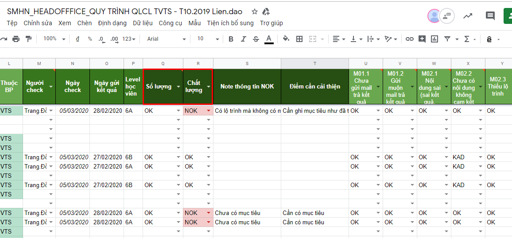

# Quy trình check email

**TRƯỚC KHI CHỌN LỖI "QUÁ HẠN GỬI EMAIL" CẦN KIỂM TRA LẠI BẰNG CÁCH:**

**VIẾT RA GIẤY - HẠN TRẢ EMAIL CUỐI CÙNG --&gt; ĐỂ KHÔNG TÍNH LỖI SAI**

**Bước 1**. Vào Excel báo cáo: [http://bit.ly/398VuHP](http://bit.ly/398VuHP)

**Bước 2.** Rà soát **số lượng/chất lượng**

**Bước 3**. Điền báo cáo trực tiếp tại trang tính

