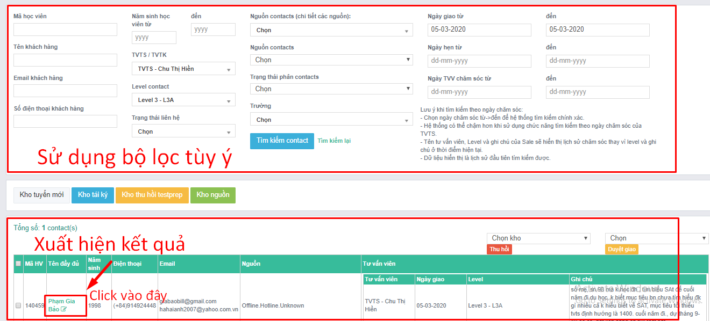
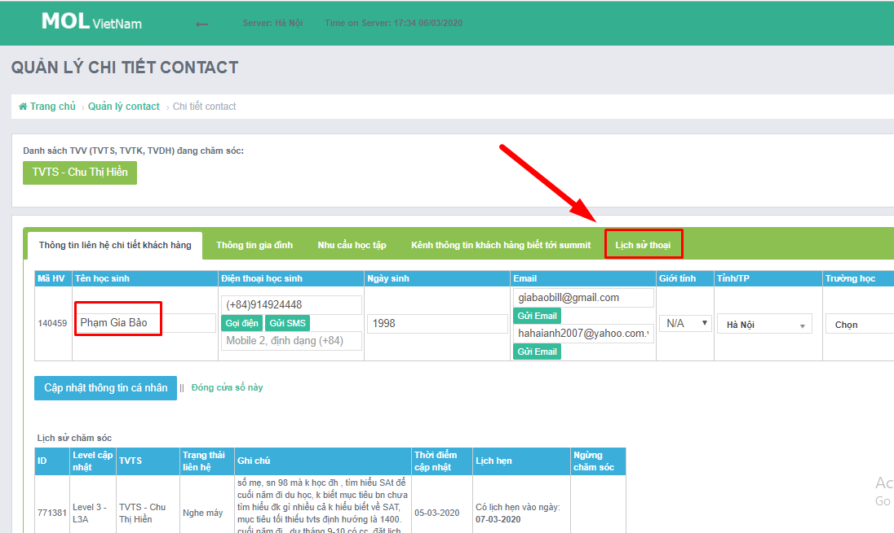
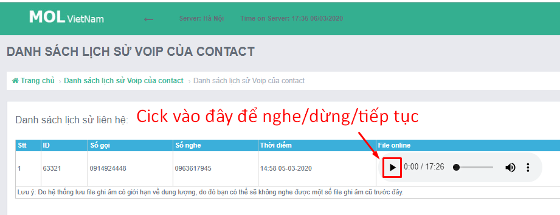
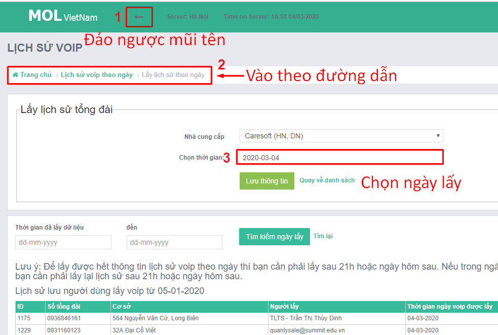

# 2.4.Check cuộc gọi

## **Bước 1.** Tìm cuộc gọi. Có 2 cách.

**Cách 1.** Bám theo "email trả kết quả"

--&gt; check cuộc gọi của Cts. \(1-3 cuộc gọi\)

* Rủi ro 1: Chỉ quan tâm đến các Cts thành công \(có email trả kết quả\). Không quan tâm các Cts chưa thành công. Điều này giống như: Đi vá những vết đạn trên thân máy bay hay là vá những vết đạn không nằm trên thân máy?
* Rủi ro 2: Cuộc gọi đầy đủ thông tin lại không thuộc phạm vi tuần đánh gián

**Cách 2.** Sử dụng bộ lọc

<table>
  <thead>
    <tr>
      <th style="text-align:left">N&#x1ED9;i dung c&#x1EA7;n check</th>
      <th style="text-align:left">B&#x1ED9; l&#x1ECD;c</th>
    </tr>
  </thead>
  <tbody>
    <tr>
      <td style="text-align:left">H&#x1ECD;c vi&#xEA;n k&#xE8;m t&#xEA;n TVTS</td>
      <td style="text-align:left">1 + 2</td>
    </tr>
    <tr>
      <td style="text-align:left">
        
V&#x1EDB;i Cts <b>&#x111;&#x1B0;&#x1EE3;c giao</b> trong tu&#x1EA7;n,

        
TVTS <b>X </b>&#x111;&#xE3; ch&#x103;m s&#xF3;c level <b>Y </b>ntn?

      </td>
      <td style="text-align:left">2 + 3 + 5</td>
    </tr>
    <tr>
      <td style="text-align:left">
        
V&#x1EDB;i Cts <b>ch&#x103;m s&#xF3;c</b> trong tu&#x1EA7;n,

        
TVTS <b>X</b> &#x111;&#xE3; ch&#x103;m s&#xF3;c level <b>Y</b> ntn?

      </td>
      <td style="text-align:left">2 + 3+ 7</td>
    </tr>
    <tr>
      <td style="text-align:left">
        
Cho ph&#xE9;p l&#x1ECD;c &#x111;&#x1ED3;ng th&#x1EDD;i:

        
Nghe m&#xE1;y, kh&#xF4;ng li&#xEA;n l&#x1EA1;c &#x111;&#x1B0;&#x1EE3;c...

      </td>
      <td style="text-align:left">4</td>
    </tr>
  </tbody>
</table>## Bước 2. Nghe ghi âm..

**\*Mẹo 1:** Nếu không thấy cuộc gọi thì làm ntn?

* Cách 1. Xem lại số điện thoại đã điền đúng hay chưa. Chỉ có 2 loại định dạng được chấp nhận là: **\(+84\)**123... hoặc **0**123.... Nếu chưa đúng thì sửa lại và nhấp "Cập nhật" rồi kiểm tra lại
* Cách 2. Sdt đúng --&gt; Lấy **"Lịch sử VoiP"**

**\*Mẹo 2:** Hướng dẫn lấy Lịch sử VoiP

## **Bước 3. Ghi kết quả**

Ghi kết quả đánh giá cuộc gọi[j: ps://forms.gle/Zc3fYdTbrqqwsd5G7](https://forms.gle/Zc3fYdTbrqqwsd5G7)

* Có các tiêu chuẩn nào để đánh giá cuộc gọi từ L1-L3
* Có các tiêu chuẩn nào để đánh giá cuộc gọi từ L5-L6...?

