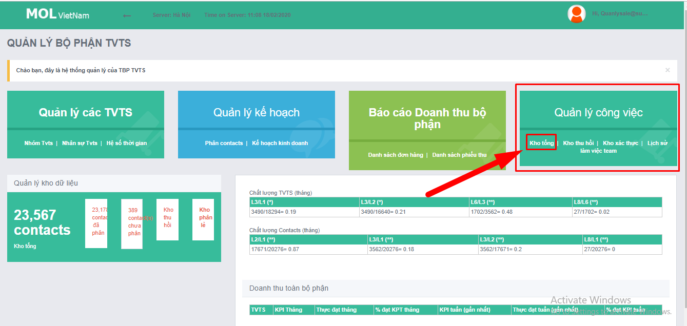
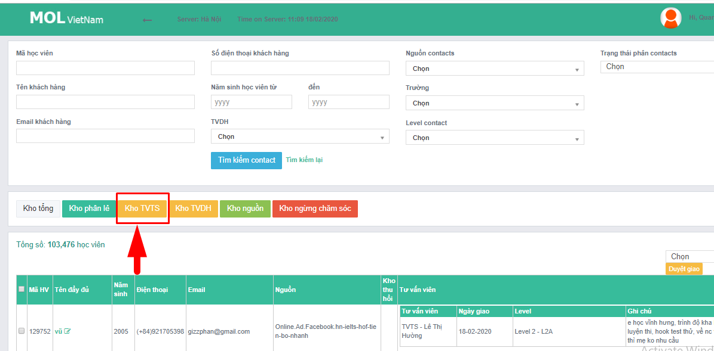

# 1.Check tồn C01.2

* 3 ngày cuối tháng chốt số được phép tồn nhưng phải giải quyết xong hết vào ngày đầu tiên đi làm của tháng tiếp theo

**Bước 1.** Mở tài liệu

* Form báo cáo lỗi:[http://bit.ly/39zZ1yM](http://bit.ly/39zZ1yM)
* **Báo cáo cá nhân**: [http://bit.ly/2SQFLGm](http://bit.ly/2SQFLGm)
* Vào CRM bằng: [https://mol.summit.edu.vn](https://mol.summit.edu.vn) \(quanlysale@summit.edu.vn\)
* **Lịch nghỉ off:** [http://bit.ly/37vM1c6](http://bit.ly/37vM1c6)
* Danh sách TVTS [http://bit.ly/2SLOkSP](http://bit.ly/2SLOkSP)

**Bước 2.** Kiểm tra Tồn C01.2

| Thao tác tại CRM |  |
| :--- | :--- |
| Bước 1. |  |
| Bước 2 |  |
| Bước 3:  **&gt;&gt;** GÕ TÊN TVTS &gt;&gt; ĐIỀN NGÀY CHECK TỒN &gt;&gt; XEM TỒN LEVEL GÌ \(nếu 7,8,C thì hợp lệ\) &gt;&gt; KIỂM TRA LỊCH LÀM VIỆC |  |

## "Tồn không hợp lệ":

* TH không tính lỗi: Gửi cảnh báo đến quản lý qua Hagout ngay
* TH tính lỗi: \(như trên\) + Điền báo cáo lỗi trên Excel và tag quản lý + Điền form đánh giá

## **\*Mẹo**

**\*Mẹo 1 check tồn nhanh:**

Dựa vào ngày nghỉ off để điền ngày check tồn sẽ ra được ngay là bạn tồn đúng quy định không?

**\*Mẹo 2 đỡ mệt, căng**

Check hết một loạt số lượng tồn rồi kiểm tra lịch làm việc của tất cả để biết ai tồn hợp lệ ai không.

