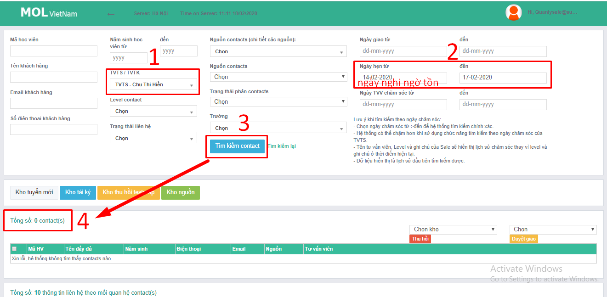
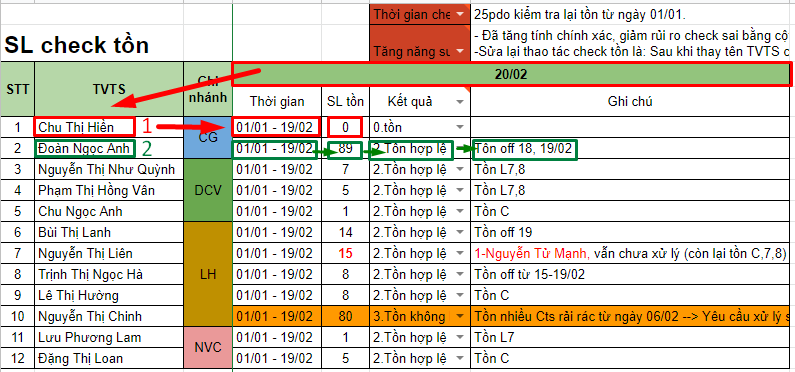

# 1.Check tồn C01.2

**3 ngày cuối tháng** chốt số được phép tồn nhưng phải giải quyết xong hết vào ngày đầu tiên đi làm của tháng tiếp theo

**Bước 1.** Mở tài liệu

* Form báo cáo lỗi:[http://bit.ly/39zZ1yM](http://bit.ly/39zZ1yM)
* **Báo cáo check**: [http://bit.ly/2SQFLGm](http://bit.ly/2SQFLGm)
* Vào CRM bằng: [https://mol.summit.edu.vn](https://mol.summit.edu.vn) \(quanlysale@summit.edu.vn\)
* **Lịch nghỉ off:** [http://bit.ly/37vM1c6](https://bit.ly/2UVuyFL)

**Bước 2.** Kiểm tra Tồn C01.2

* Gõ tên VTTS/Điền ngày check tồn/Xem tên level gì: nếu 7,8,C thì hợp lệ, nếu khác thì kiểm tra lịch làm việc.

**Bước 3**. Điền báo cáo

Tồn không hợp lệ":

* Gửi cảnh báo đến quản lý qua Hagout
* Điền form báo cáo lỗi, sau khi được quản lý xác nhận \(nếu cần\)

## **\*Mẹo**

**\*Mẹo 1 check tồn nhanh:**

Dựa vào ngày nghỉ off để điền ngày check tồn sẽ ra được ngay là bạn tồn đúng quy định không?

**\*Mẹo 2 giảm rủi ro nhầm lẫn:**

Check hết một loạt số lượng tồn rồi kiểm tra lịch làm việc của tất cả để biết ai tồn hợp lệ ai không.

