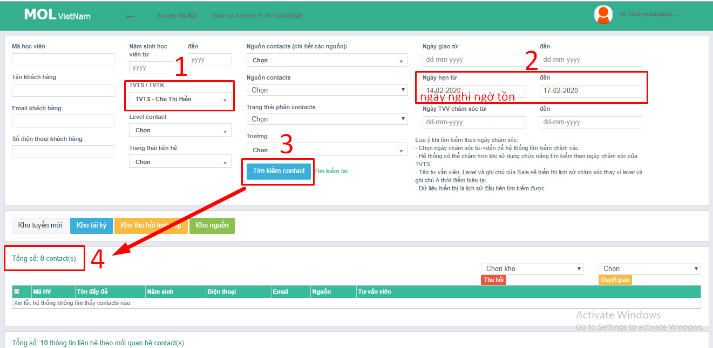
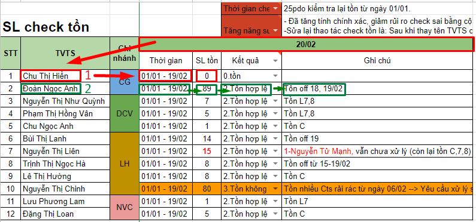

# 2.1.Check tồn C01.2

**3 ngày cuối tháng** chốt số được phép tồn nhưng **phải giải quyết xong hết vào ngày đầu tiên đi làm** của tháng tiếp theo

### **Bước 1.** Mở tài liệu

* Form báo cáo lỗi:[http://bit.ly/39zZ1yM](http://bit.ly/39zZ1yM)
* **Báo cáo check**: [**http://bit.ly/3bDIUEM**](http://bit.ly/3bDIUEM)\*\*\*\*
* Vào CRM bằng: [https://mol.summit.edu.vn](https://mol.summit.edu.vn) 
* **Lịch nghỉ off:** [http://bit.ly/39z5Ima](http://bit.ly/39z5Ima)

### **Bước 2.** Kiểm tra Tồn ngày hẹn/Tồn ngày giao

Gõ tên TVTS/Điền ngày check tồn/Xem tên level gì: nếu 7,8,C thì hợp lệ, nếu khác thì kiểm tra lịch làm việc.

### **Bước 3**. Điền báo cáo

**Tồn hợp lệ:**

* Cts mới bàn giao khi TVTS nghỉ off.
* Cts bàn giao ngày hôm nay nhưng lại có lịch hẹn từ trước đó

**Tồn không hợp lệ:**

* Gửi cảnh báo đến quản lý qua Email hàng ngày
* Điền form báo cáo lỗi, sau khi được quản lý xác nhận \(nếu cần\)

### **\*Mẹo giảm rủi ro nhầm lẫn:**

Check hết một loạt số lượng tồn rồi kiểm tra lịch làm việc của tất cả để biết ai tồn hợp lệ ai không.

