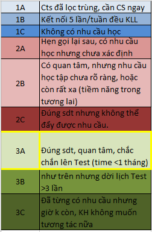
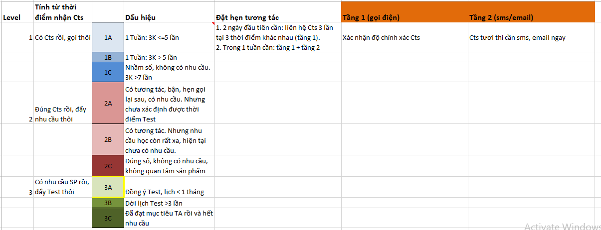

# Hệ thống level chi tiết & Quy trình TS

**Riêng với Cts Off: 3K = 3 được chuyển B**

Hệ thống level chi tiết: [https://docs.google.com/spreadsheets/d/1jVoTn4gCQ9dP0E7D0\_YaJHUgaUPcfIwxxJnVQ5CXAII/edit?ts=5e433cd4\#gid=889384981](https://docs.google.com/spreadsheets/d/1jVoTn4gCQ9dP0E7D0_YaJHUgaUPcfIwxxJnVQ5CXAII/edit?ts=5e433cd4#gid=889384981)

\*\*\*\*

\*\*\*\*

