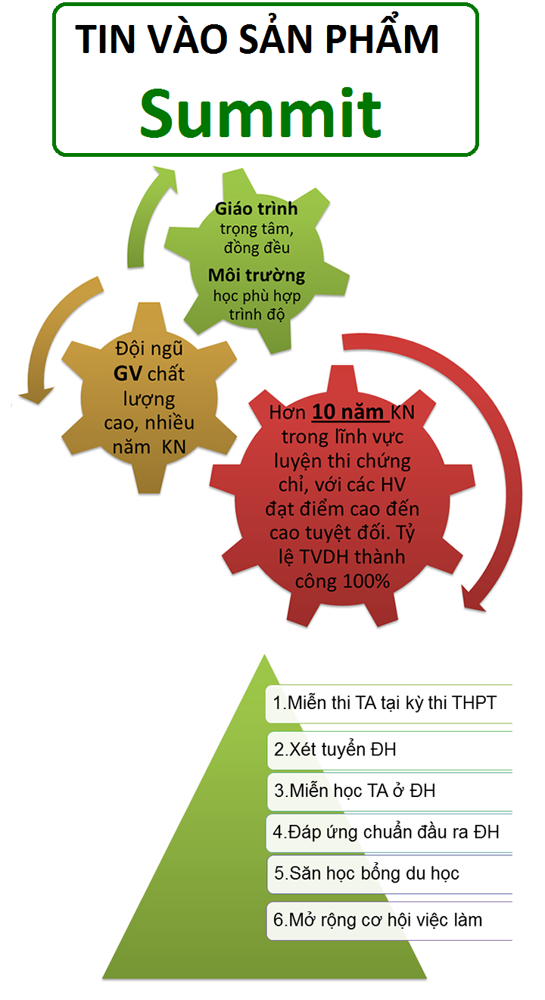

# 4.Bàn giao cts L4

Bước 1. Điền form lên L4 [https://bit.ly/3bRdhEy](https://bit.ly/3bRdhEy)

Bước 2. Chọn TVTS cần bàn giao [https://bit.ly/2Rd6VaF](https://bit.ly/2Rd6VaF)

Bước 3. Điền bàn giao 

Bước 4. Báo quản lý chi nhánh thực hiện bàn giao trên CRM

