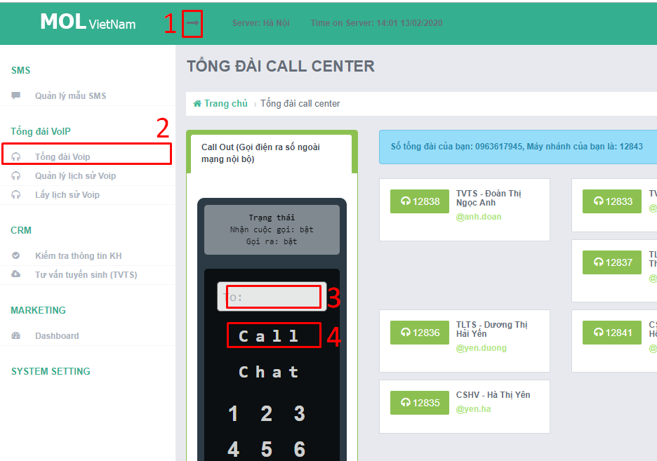
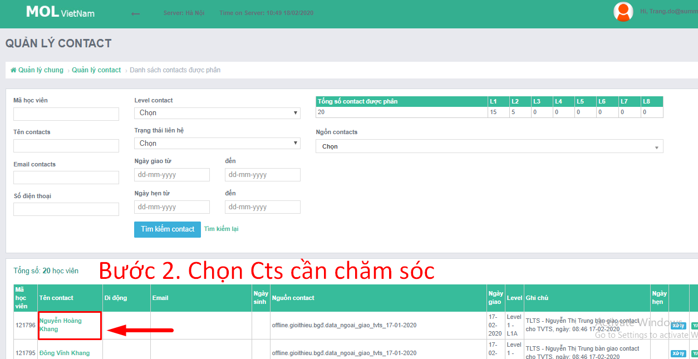
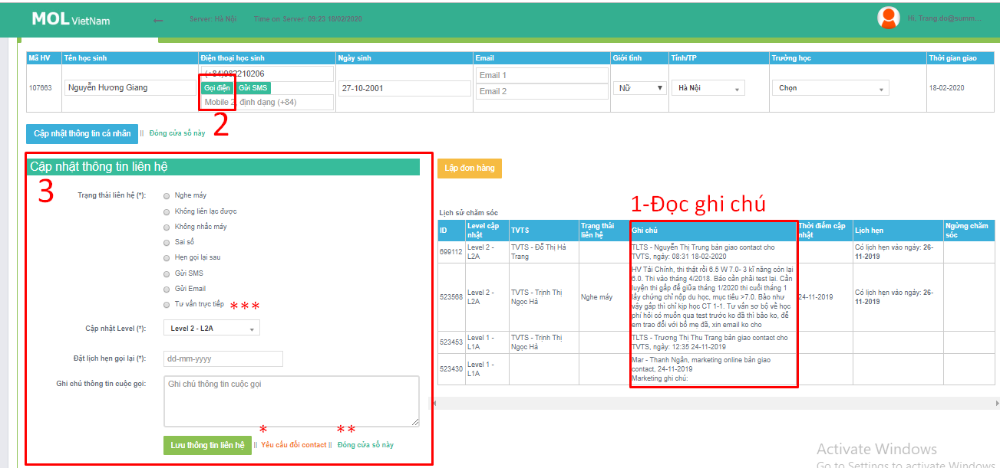

# 1.Hướng dẫn sử dụng phần mềm CRM

Đăng nhập CRM với tài khoản TVTS: [https://mol.summit.edu.vn/](https://mol.summit.edu.vn/)

### Quy trình gọi và nhập liệu 

<table>
  <thead>
    <tr>
      <th style="text-align:left"></th>
      <th style="text-align:left"></th>
    </tr>
  </thead>
  <tbody>
    <tr>
      <td style="text-align:left">
        

        
Cts ch&#x1B0;a t&#x1ED3;n t&#x1EA1;i:
           - &#x110;&#x103;ng nh&#x1EAD;p CRM b&#x1EB1;ng t&#xE0;i kho&#x1EA3;n TVTS

        
- &#x110;i&#x1EC1;n s&#x1ED1; v&#xE0; g&#x1ECD;i nh&#xE9;

        

      </td>
      <td style="text-align:left">
        
      </td>
    </tr>
    <tr>
      <td style="text-align:left">
        
Cts &#x111;&#xE3; t&#x1ED3;n t&#x1EA1;i:

        
1- &#x110;&#x1ECD;c ghi ch&#xFA;

        
2- G&#x1ECD;i &#x111;i&#x1EC7;n

        
3- Nh&#x1EAD;p li&#x1EC7;u

        
(i)Gi&#x1EA3;i th&#xED;ch th&#xEA;m v&#x1EC1; c&#xE1;ch ch&#x1ECD;n &quot;tr&#x1EA1;ng
          th&#xE1;i&quot;

        
(ii)Gi&#x1EA3;i th&#xED;ch v&#x1EC1; c&#xE1;ch ch&#x1ECD;n level

        
(iii)C&#xE1;ch ch&#x1ECD;n th&#x1EDD;i gian

      </td>
      <td style="text-align:left">
        
B1.&#x110;&#x103;ng nh&#x1EAD;p h&#x1EC7; th&#x1ED1;ng
           
          
           B2
          
        

        
B3

        

          
        

      </td>
    </tr>
  </tbody>
</table>\(i\)???

### \(ii\) Level   

\(iii\) ??**A-7** ngày, **B-1** tháng, **6A-3** ngày, **5A,B-3** ngày.  
Đề xuất cải tiến \(iii\):  
A-Đặt điều kiện cho ngày hẹn theo Level. Giúp giảm rủi ro sau:  
- ...  
- .....  
B-Khi nhập liệu thiếu, cần nhập thêm, không nên bắt nhập lại từ đầu vì làm giảm năng suất làm việc TVTS

### Nếu gọi không nghe máy, nên giữ nguyên level cũ

### Mẹo chỉnh sửa thông tin đã nhập/chọn nhầm trên CRM

