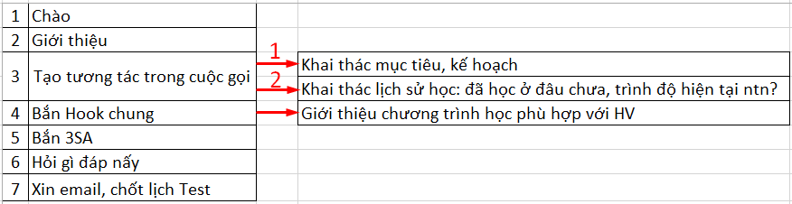

# 2.3.KB - Cuộc gọi L1-L3

## Kịch bản thu gọn:

**\*Lưu ý mục tiêu kịch bản:** Câu càng ngắn càng tốt \(để nói càng ít càng tốt\), tránh đưa thông tin trùng lặp trong cuộc gọi vì thời lượng cuộc gọi thông thường từ 3-5 phút, hoặc 7-9 phút.

## Kịch bản chi tiết

<table>
  <thead>
    <tr>
      <th style="text-align:left"></th>
      <th style="text-align:left"></th>
    </tr>
  </thead>
  <tbody>
    <tr>
      <td style="text-align:left">Ch&#xE0;o, gi&#x1EDB;i thi&#x1EC7;u</td>
      <td style="text-align:left">
        
- Ch&#xE0;o anh/ch&#x1ECB;, cho em h&#x1ECF;i &#x111;&#xE2;y c&#xF3; ph&#x1EA3;i
          sdt c&#x1EE7;a...

        
- Em nh&#x1EAD;n th&#xF4;ng tin l&#xE0; gia &#x111;&#xEC;nh minh &#x111;ang
          quan t&#xE2;m t&#x1EDB;i ch&#x1B0;&#x1A1;ng tr&#xEC;nh h&#x1ECD;c TA cho
          b&#x1EA1;n... nh&#xE0; m&#xEC;nh ph&#x1EA3;i kh&#xF4;ng &#x1EA1;?

        
- V&#x1EAD;y c&#xF3; th&#x1EC3; l&#xE0; b&#x1EA1;n nh&#xE0; m&#xEC;nh
          &#x111;&#xE3; &#x111;&#x1EC3; l&#x1EA1;i th&#xF4;ng tin c&#x1EE7;a ph&#x1EE5;
          huynh t&#x1EA1;i c&#xE1;c CT do SM t&#xE0;i tr&#x1EE3; t&#x1EA1;i tr&#x1B0;&#x1EDD;ng
          c&#x1EE7;a b&#x1EA1;n.

        
- Kh&#xF4;ng bi&#x1EBF;t b&#xE2;y gi&#x1EDD; anh/ch&#x1ECB; c&#xF3; r&#x1EA3;nh
          ch&#x1EEB;ng 5 ph&#xFA;t &#x111;&#x1EC3; em xin trao &#x111;&#x1ED5;i th&#xEA;m
          v&#x1EC1; CT h&#x1ECD;c ph&#xF9; h&#x1EE3;p v&#x1EDB;i b&#x1EA1;n kh&#xF4;ng
          &#x1EA1;?

      </td>
    </tr>
    <tr>
      <td style="text-align:left">L&#xFD; do v&#xEC; sao c&#x1EA7;n ch&#x1ECD;n SM</td>
      <td style="text-align:left">B&#x1EAF;n SA, hook SM, hook Test</td>
    </tr>
  </tbody>
</table>|  |  |
| :--- | :--- |

<table>
  <thead>
    <tr>
      <th style="text-align:left">Ch&#xE0;o, Gi&#x1EDB;i thi&#x1EC7;u</th>
      <th style="text-align:left">
        
- Ch&#xE0;o anh/ch&#x1ECB;, cho em h&#x1ECF;i &#x111;&#xE2;y c&#xF3; ph&#x1EA3;i <b>sdt c&#x1EE7;a.....</b>?

        
- <b>Em l&#xE0; Trang, g&#x1ECD;i &#x111;i&#x1EC7;n t&#x1EEB; Anh ng&#x1EEF; Summit, hi&#x1EC7;n SM &#x111;ang h&#x1ED7; tr&#x1EE3; &#x111;&#xE0;o t&#x1EA1;o c&#xE1;c ch&#x1EE9;ng ch&#x1EC9; IE,TF,SAT kh&#xF4;ng bi&#x1EBF;t c&#xF3; th&#x1EC3; h&#x1ED7; tr&#x1EE3; g&#xEC; cho ...? ho&#x1EB7;c &quot;chuy&#xEA;n &#x111;&#xE0;o t&#x1EA1;o c&#xE1;c ch&#x1EE9;ng ch&#x1EC9; IE,TF,SAT v&#xE0; TVDH&quot;</b>
        

        
<b>Cts off:</b> Kh&#xF4;ng bi&#x1EBF;t hi&#x1EC7;n t&#x1EA1;i a/c &#x111;&#xE3;
          c&#xF3; k&#x1EBF; ho&#x1EA1;ch hay d&#x1EF1; &#x111;&#x1ECB;nh cho b&#x1EA1;n
          nh&#xE0; m&#xEC;nh luy&#x1EC7;n thi c&#xE1;c ch&#x1EE9;ng ch&#x1EC9;...
           Cts t&#x1B0;&#x1A1;i: Em nh&#x1EAD;n &#x111;&#x1B0;&#x1EE3;c th&#xF4;ng
          tin l&#xE0; gia &#x111;&#xEC;nh m&#xEC;nh &#x111;ang quan t&#xE2;m t&#x1EDB;i
          ch&#x1B0;&#x1A1;ng tr&#xEC;nh h&#x1ECD;c TA cho b&#x1EA1;n &#x111;&#xFA;ng
          kh&#xF4;ng &#x1EA1;?
           - &#xC0;, v&#x1EAD;y c&#xF3; th&#x1EC3; l&#xE0; b&#x1EA1;n nh&#xE0; m&#xEC;nh
          &#x111;&#xE3; &#x111;&#x1EC3; l&#x1EA1;i th&#xF4;ng tin c&#x1EE7;a ph&#x1EE5;
          huynh t&#x1EA1;i c&#xE1;c <b>ch&#x1B0;&#x1A1;ng tr&#xEC;nh do SM t&#xE0;i tr&#x1EE3;</b> t&#x1EA1;i
          tr&#x1B0;&#x1EDD;ng c&#x1EE7;a b&#x1EA1;n/
           - Kh&#xF4;ng bi&#x1EBF;t b&#xE2;y gi&#x1EDD; a/c c&#xF3; r&#x1EA3;nh ch&#x1EEB;ng <b>5p</b> &#x111;&#x1EC3;
          em xin trao &#x111;&#x1ED5;i th&#xEA;m v&#x1EC1; CT h&#x1ECD;c TA ph&#xF9;
          h&#x1EE3;p v&#x1EDB;i b&#x1EA1;n &#x111;&#x1B0;&#x1EE3;c kh&#xF4;ng &#x1EA1;?
           (B&#x1EAD;n --&gt; Anh/ch&#x1ECB; r&#x1EA3;nh th&#x1EDD;i gian n&#xE0;o
          &#x111;&#x1EC3; em li&#xEA;n h&#x1EC7; l&#x1EA1;i/ cho em xin email.. /khi
          c&#xF3; nhu c&#x1EA7;u v&#x1EC1; luy&#x1EC7;n thi ch&#x1EE9;ng ch&#x1EC9;
          IE, TF, SAT..m&#x1EDD;i ... )

      </th>
    </tr>
  </thead>
  <tbody></tbody>
</table>|  | Excel... |
| :--- | :--- |

<table>
  <thead>
    <tr>
      <th style="text-align:left">B&#x1EAF;n 3SA</th>
      <th style="text-align:left">
        
<em>(b&#x1EAF;n tr&#x1B0;&#x1EDB;c/trong/sau qu&#xE1; tr&#xEC;nh gi&#x1EDB;i thi&#x1EC7;u ch&#x1B0;&#x1A1;ng tr&#xEC;nh h&#x1ECD;c)</em>
        

        
<b>SM &#x111;&#x1EBF;n nay &#x111;&#xE3; c&#xF3; h&#x1A1;n 10 n&#x103;m kinh nghi&#x1EC7;m trong l&#x129;nh v&#x1EF1;c luy&#x1EC7;n thi ch&#x1EE9;ng ch&#x1EC9; v&#xE0; TVDH. V&#x1EDB;i r&#x1EA5;t nhi&#x1EC1;u HV thi &#x111;&#x1EA1;t &#x111;i&#x1EC3;m cao/cao tuy&#x1EC7;t &#x111;&#x1ED1;i, t&#x1EC9; l&#x1EC7; TVDH th&#xE0;nh c&#xF4;ng 100%.</b>
        

        
- Gi&#xE1;o vi&#xEA;n ch&#x1EA5;t l&#x1B0;&#x1EE3;ng cao

        
- M&#xF4;i tr&#x1B0;&#x1EDD;ng h&#x1ECD;c t&#x1EAD;p ph&#xF9; h&#x1EE3;p

        
- Gi&#xE1;o tr&#xEC;nh chi ti&#x1EBF;t v&#x1EEB;a tr&#x1ECD;ng t&#xE2;m
          v&#x1EEB;a &#x111;&#x1ED3;ng &#x111;&#x1EC1;u

      </th>
    </tr>
  </thead>
  <tbody></tbody>
</table>|  | Giới thiệu CT học phù hợp: SL cấp độ -- Đặc trưng phù hợp - Thời gian học -- Mục tiêu đầu ra - Giáo viên |
| :--- | :--- |

| JUNIOR |  |
| :--- | :--- |

| IELTS | - IE ở Summit cung cấp **quá trình luyện tập tổng thể** từ trình độ cơ bản đến nâng cao \(Pre, trung cấp \(foundation\), cao \(advanced\). - **Để giúp HV tiến bộ** trong thời gian ngắn nhắn, giáo trình được thiết kế trọng tâm với cường độ học phù hợp **~60 giờ/khóa**. - GV có chuyên môn cao kết hợp cả GVNN và GVVN nhằm giúp HV đạt được mục tiêu IE 7.0 - 7.5. - IE SM có **7 cấp độ**, để biết.... |
| :--- | :--- |

| TOEFL | - TF ở Summit cung cấp **quá trình luyện tập tổng thể** từ trình độ cơ bản đến nâng cao \(Pre, trung cấp \(foundation\), cao \(advanced\).\) - **Để giúp HV tiến bộ** trong thời gian ngắn nhắn, giáo trình được thiết kế trọng tâm với cường độ học phù hợp **~60 giờ/khóa**. - Với đặc thù chuyên sâu, để đạt được mục tiêu đầu ra TF 80 - 90, GV Toefl SM 100% là người Việt. - TF SM có **5 cấp độ**, để biết.... |
| :--- | :--- |

| SAT | 5 cấp độ. Cần IE 6.0/ TF 70 trước khi vào học SAT. |
| :--- | :--- |

| Hỏi gì đáp nấy | Sử dụng FAQs |
| :--- | :--- |

| Chốt | Xin email, chốt lịch Test \(Nơi ở của HV, thời gian có thể đến\) |
| :--- | :--- |

