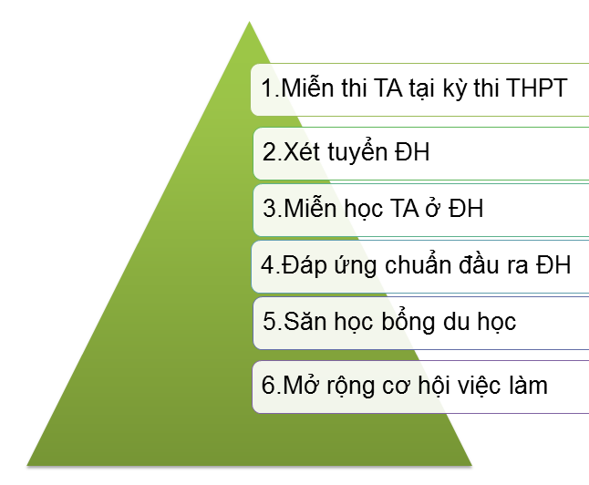
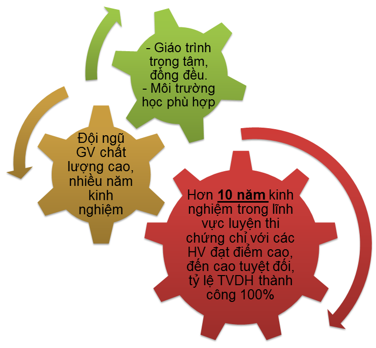
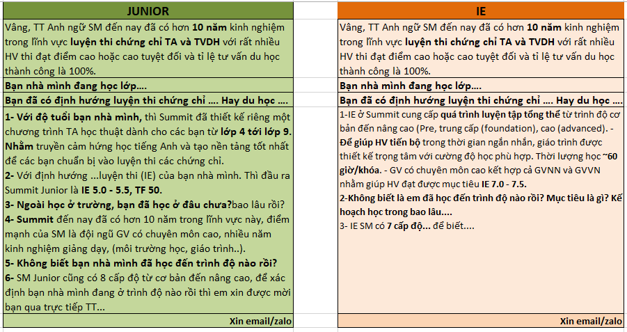

# 2.2.KB - Cuộc gọi lọc

### 1.**Mục đích:** 

Hook Test + Hook SM/SA + **Đánh giá mức độ tiềm năng**

### **2.Cách gọi:**

**Cách 1.** \(mục đích lọc HV có tiềm năng\)

<table>
  <thead>
    <tr>
      <th style="text-align:left"><b>TVTS</b>
      </th>
      <th style="text-align:left">HV</th>
    </tr>
  </thead>
  <tbody>
    <tr>
      <td style="text-align:left">
        
- <b>Gi&#x1EDB;i thi&#x1EC7;u:</b> Em l&#xE0; Trang, g&#x1ECD;i &#x111;&#x1EBF;n
          t&#x1EEB; Anh ng&#x1EEF; Summit, chuy&#xEA;n &#x111;&#xE0;o t&#x1EA1;o
          c&#xE1;c ch&#x1EE9;ng ch&#x1EC9; IE,TF,SAT v&#xE0; TVDH.

        
- <b>L&#x1ECD;c nhu c&#x1EA7;u:</b> Hi&#x1EC7;n t&#x1EA1;i m&#xEC;nh c&#xF3;
          quan t&#xE2;m ... kh&#xF4;ng/Kh&#xF4;ng bi&#x1EBF;t c&#xF3; th&#x1EC3;
          h&#x1ED7; tr&#x1EE3; g&#xEC; cho gia &#x111;&#xEC;nh/em kh&#xF4;ng?

      </td>
      <td style="text-align:left">
        
C&#xF3;/

        
kh&#xF4;ng

      </td>
    </tr>
    <tr>
      <td style="text-align:left">
        
- <b>T&#x1EA1;o thi&#x1EBF;t l&#x1EAD;p: </b>Hi&#x1EC7;n t&#x1EA1;i SM
          &#x111;ang c&#xF3; CT cho c&#xE1;c b&#x1EA1;n l&#xE0;m b&#xE0;i Test ki&#x1EC3;m
          tra tr&#xEC;nh &#x111;&#x1ED9; mi&#x1EC5;n ph&#xED;/c&#x169;ng nh&#x1B0;
          gi&#xFA;p PH &#x111;&#xE1;nh gi&#xE1; hi&#x1EC7;u qu&#x1EA3; h&#x1ECD;c
          t&#x1EAD;p.
           (V&#x1EDB;i PH: --&gt; Kh&#xF4;ng bi&#x1EBF;t ch&#x1ECB; c&#xF3; mu&#x1ED1;n
          cho b&#x1EA1;n tham gia Test th&#x1EED; na&#x300;y kh&#xF4;ng &#x1EA1;?)

        
- B&#xE0;i Test &#x111;&#x1B0;&#x1EE3;c c&#xE1;c GV c&#xF3; tr&#xEC;nh
          &#x111;&#x1ED9; cao c&#x1EE7;a SM &#x111;&#xE1;nh gi&#xE1; c&#x1EA3; 4
          k&#x1EF9; n&#x103;ng.. gi&#xFA;p con ch&#x1EC9; ra &#x111;&#x1B0;&#x1EE3;c
          c&#xE1;c &#x1B0;u &#x111;i&#x1EC3;m v&#xE0;... &#x111;i&#x1EC3;m c&#x1EA7;n
          t&#xE2;&#x323;p trung c&#x1EA3;i thi&#x1EC7;n.

        
Ba&#x300;i Test &#x111;&#x1B0;&#x1A1;&#x323;c th&#x1B0;&#x323;c hi&#xEA;&#x323;n
          t&#x1B0;&#x300; 8h - 6h chi&#xEA;&#x300;u ca&#x301;c nga&#x300;y trong
          tu&#xE2;&#x300;n. Ta&#x323;i 4 c&#x1A1; s&#x1EDF;:

        
La&#x301;ng Ha&#x323;, C&#xE2;&#x300;u Gi&#xE2;&#x301;y, Ph&#xF4;&#x301;
          Hu&#xEA;&#x301;, Nguy&#xEA;&#x303;n V&#x103;n C&#x1B0;&#x300;.
           <b>(V&#x1EDB;i HS - Kh&#xF4;ng bi&#x1EBF;t em/b&#x1EA1;n &#x111;&#xE3; &#x111;i h&#x1ECD;c &#x1EDF; TT n&#xE0;o ch&#x1B0;a? tr&#xEC;nh &#x111;&#x1ED9; &#x111;ang &#x1EDF; m&#x1EE9;c n&#xE0;o?)</b>
        

      </td>
      <td style="text-align:left">
        
Th&#xED;ch/

        
l&#x1B0;&#x1EE1;ng l&#x1EF1;/Kh&#xF4;ng c&#xF3; NC

      </td>
    </tr>
    <tr>
      <td style="text-align:left">
        
- <b>M&#x1EE5;c ti&#xEA;u h&#x1ECD;c TA &#x111;&#x1EC3; ..</b>.? <b>&#x110;i&#x323;nh h&#x1B0;&#x1A1;&#x301;ng ho&#x323;c t&#xE2;&#x323;p</b> trong
          t&#x1B0;&#x1A1;ng lai ntn?

        
- Chia s&#x1EBB;/&#x111;&#x1ED3;ng c&#x1EA3;m:<b> L&#x1EE3;i &#xED;ch</b> h&#x1ECD;c
          TA...

      </td>
      <td style="text-align:left">C&#xF3; m&#x1EE5;c ti&#xEA;u/Ch&#x1B0;a c&#xF3; m&#x1EE5;c ti&#xEA;u</td>
    </tr>
    <tr>
      <td style="text-align:left">
        
- <b>Hook</b>: Tuy nhi&#xEA;n &#x111;&#x1EC3; &#x111;&#x1EA1;t &#x111;&#x1B0;&#x1EE3;c
          m&#x1EE5;c ti&#xEA;u th&#xEC; c&#x1EA7;n c&#x1EA3; m&#x1ED9;t qu&#xE1;
          tr&#xEC;nh h&#x1ECD;c t&#x1EAD;p l&#xE2;u d&#xE0;i.

        
- <b>H&#x1ECF;i &#x111;&#x1ECB;a ch&#x1EC9;</b> ... Gi&#x1EDB;i thi&#x1EC7;u
          4 &#x111;&#x1ECB;a &#x111;i&#x1EC3;m SM &#x1EDF; HN. V&#x1EDB;i &#x111;&#x1ECB;a
          ch&#x1EC9; v&#x1EEB;a r&#x1ED3;i th&#xEC; c&#x1A1; s&#x1EDF; ... l&#xE0;
          g&#x1EA7;n nh&#x1EA5;t ph&#x1EA3;i kh&#xF4;ng?

        
<b>- Em/B&#x1EA1;n/Anh-Ch&#x1ECB; &#x111;&#xE3; bi&#x1EBF;t v&#x1EC1; SM ch&#x1B0;a?</b>
        

        
--&gt; Gi&#x1EDB;i thi&#x1EC7;u: Hook SM, SA

      </td>
      <td style="text-align:left">
        
- &#x1EDE; trung t&#xE2;m/&#x1EDE; xa

        
- Bi&#x1EBF;t SM/Kh&#xF4;ng

      </td>
    </tr>
    <tr>
      <td style="text-align:left">
        
Ch&#x1ED1;t:

        
- Hook Test v&#x1EDB;i HV c&#xF3; <b>ti&#x1EC1;m n&#x103;ng</b>
        

        
- <b>Xin email + zalo</b>
        

      </td>
      <td style="text-align:left">Ch&#x1ED1;t/Ch&#x1B0;a ch&#x1ED1;t</td>
    </tr>
  </tbody>
</table>

**Cách 2.** \(mục đích hook Test & lan tỏa thương hiệu\)

Em là Trang, gọi đến từ Anh ngữ Summit, chuyên đào tạo chứng chỉ **IE, TF, SAT và TVDH.** Hiện nay SM đang có chương trình cho các bạn làm một bài **Test** kiểm tra trình độ miễn phí**/**.. Bài kiểm tra sẽ được các giảng viên có trình độ cao, nhiều năm kinh nghiệm giảng dạy đánh giá - Cũng là một cách để PH có thể biết con em mình cần bổ sung kiến thức phần nào ...**/**Thì không biết có thể hỗ trợ cho gia đình mình không ạ?

\*\*\*\*

\*\*\*\*

Đánh giá mức độ tiềm năng của HV:

* Nếu đang học TT TA khác thì khi nào xong?
* Nếu chưa học TT thì khi nào có kế hoạch học, mục tiêu ra sao?
* Mức độ đầu tư cho việc học TA ở trong khoảng nào?

**Nguồn Cts Off:**

**Cách 3.** Em là Trang, gọi đến từ Anh Ngữ Summit, Hiện SM đang có chương trình cho các bạn làm Kiểm tra TA **miễn phí** và **nhận quà**. Không biết **gia đình** có thể **sắp xếp thời gian** cho bạn tham gia chương trình được không ạ? Không . Dạ vâng, tức là bên em sẽ hỗ trợ cho các bạn làm bài tại trung tâm hoặc làm online tại nhà. Các bạn nhà hiện tại chắc là vẫn đang được nghỉ học phải không ạ? Thì có thể sắp xếp thời gian làm bài vào buổi sáng hoặc buổi chiều đều được ạ.

**Hook SM, SA**

Đang học TT khác rồi... --&gt; Dạ vâng, bài Test sẽ giúp kiểm tra hiệu quả học tập miễn phí. Đề thi được biên soạn sát theo format đề thi chuẩn hóa IE,TF,SAT. Giúp bạn vừa làm quen đề, vừa được nhận xét về ưu và các điểm cần cải thiện.. --&gt; Không biết a/chị có thể sắp xếp thời gian cho bạn tham gia không ạ?

**Cách 1.** - Em là Trang, gọi đến từ Anh ngữ Summit, hiện tại SM đang hỗ trợ đào tạo các chứng chỉ IE,TF,SAT. Không biết có thể hỗ trợ gì cho gia đình mình không ạ?

* Không biết hiện tại anh/chị đã có kế  hoạch hay dự định cho bạn luyện thi chứng chỉ IE,TF, SAT?  
* Gia đình mình có ai có nhu cầu luyện thi các chứng chỉ này không ạ?
* Không --&gt; À, dạ, không biết là các bạn nhà mình vẫn đang trong độ tuổi đi học đúng không ạ?

### **3.Cts giới thiệu:**

Bước 1. Điền form. Link...

Bước 2. tại nhóm chat Sale Suport, nhắc SS lọc trùng giúp cts. Sau khi SS lọc trùng thì cts sẽ chuyển về CRM của mình

Giới thiệu --&gt; Hỏi lọc --&gt; Xin email --&gt; Hook, chốt

