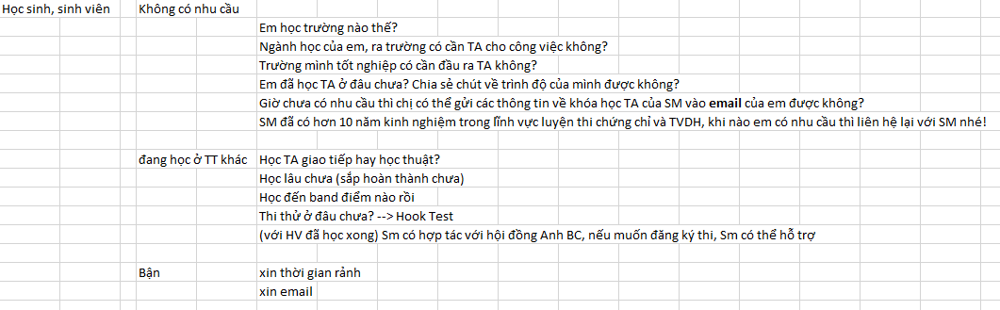

# 2.2.KB - Cuộc gọi lọc

**Nguồn Cts Off:**

**Cách 3.** Em là Trang, gọi đến từ Anh Ngữ Summit, Hiện SM đang có chương trình cho các bạn làm Kiểm tra TA **miễn phí** và **nhận quà**. Không biết **gia đình** có thể **sắp xếp thời gian** cho bạn tham gia chương trình được không ạ? Không . Dạ vâng, tức là bên em sẽ hỗ trợ cho các bạn làm bài tại trung tâm hoặc làm online tại nhà. Các bạn nhà hiện tại chắc là vẫn đang được nghỉ học phải không ạ? Thì có thể sắp xếp thời gian làm bài vào buổi sáng hoặc buổi chiều đều được ạ.

**Hook SM, SA**

Đang học TT khác rồi... --&gt; Dạ vâng, bài Test sẽ giúp kiểm tra hiệu quả học tập miễn phí. Đề thi được biên soạn sát theo format đề thi chuẩn hóa IE,TF,SAT. Giúp bạn vừa làm quen đề, vừa được nhận xét về ưu và các điểm cần cải thiện.. --&gt; Không biết a/chị có thể sắp xếp thời gian cho bạn tham gia không ạ?

**Cách 1.** - Em là Trang, gọi đến từ Anh ngữ Summit, hiện tại SM đang hỗ trợ đào tạo các chứng chỉ IE,TF,SAT. Không biết có thể hỗ trợ gì cho gia đình mình không ạ?

* Không biết hiện tại anh/chị đã có kế  hoạch hay dự định cho bạn luyện thi chứng chỉ IE,TF, SAT?  
* Gia đình mình có ai có nhu cầu luyện thi các chứng chỉ này không ạ?

Không --&gt; À, dạ, không biết là các bạn nhà mình vẫn đang trong độ tuổi đi học đúng không ạ?

**Cách 2.** Em là Trang, gọi đến từ Anh ngữ Summit, chuyên đào tạo chứng chỉ **IE, TF, SAT và TVDH.** Hiện nay SM đang có chương trình cho các bạn làm một bài **Test** kiểm tra trình độ miễn phí**/**.. Bài kiểm tra sẽ được các giảng viên có trình độ cao, nhiều năm kinh nghiệm giảng dạy đánh giá - Cũng là một cách để PH có thể biết con em mình cần bổ sung kiến thức phần nào ...**/**Thì không biết có thể hỗ trợ cho gia đình mình không ạ?

* Với HS đang học ở **TT khác rồi** có 5 nội dung có thể khai thác và hook:
* Học TA giao tiếp hay học thuật?
* Học lâu chưa \(sắp hoàn thành chưa\)
* Học đến band điểm nào rồi
* Thi thử ở đâu chưa? --&gt; Hook Test
* \(với HV đã học xong\) Sm có hợp tác với hội đồng Anh BC, nếu muốn đăng ký thi, Sm có thể hỗ trợ
* Với lứa tuổi HS chưa có nhu cầu...
* Với Cts Chưa có tên - tức là phụ huynh thì hỏi **gia đình**
* Không --&gt; Vậy có thể cho em **xin email** để gửi các thông tin về Summit để khi anh/chị có nhu cầu có thể tiện liên hệ lại được không ạ? Summit là TT Anh Ngữ đã có hơn 10 năm kinh nghiệm trong lĩnh vực đà tạo chứng chỉ và TVDH...

* **Cts giới thiệu:**

Bước 1. Điền form. LInk...

Bước 2. tại nhóm chat Sale Suport, nhắc SS lọc trùng giúp cts. Sau khi SS lọc trùng thì cts sẽ chuyển về CRM của mình

Giới thiệu --&gt; Hỏi lọc --&gt; Xin email --&gt; Hook, chốt

