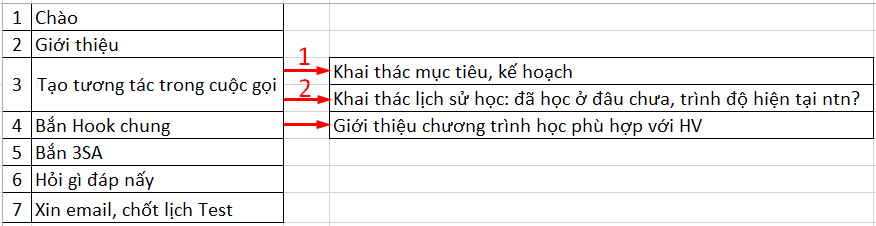

# 2.3.KB - Cuộc gọi L1-L3

## Kịch bản thu gọn:

**\*Lưu ý mục tiêu kịch bản:** Câu càng ngắn càng tốt \(để nói càng ít càng tốt\), tránh đưa thông tin trùng lặp trong cuộc gọi vì thời lượng cuộc gọi thông thường từ 3-5 phút, hoặc 7-9 phút.

## Kịch bản chi tiết

<table>
  <thead>
    <tr>
      <th style="text-align:left"></th>
      <th style="text-align:left"></th>
    </tr>
  </thead>
  <tbody>
    <tr>
      <td style="text-align:left">Ch&#xE0;o, gi&#x1EDB;i thi&#x1EC7;u</td>
      <td style="text-align:left">
        
- Ch&#xE0;o anh/ch&#x1ECB;, cho em h&#x1ECF;i &#x111;&#xE2;y c&#xF3; ph&#x1EA3;i
          sdt c&#x1EE7;a...

        
- Em nh&#x1EAD;n th&#xF4;ng tin l&#xE0; gia &#x111;&#xEC;nh minh &#x111;ang
          quan t&#xE2;m t&#x1EDB;i ch&#x1B0;&#x1A1;ng tr&#xEC;nh h&#x1ECD;c TA cho
          b&#x1EA1;n... nh&#xE0; m&#xEC;nh ph&#x1EA3;i kh&#xF4;ng &#x1EA1;?

        
- V&#x1EAD;y c&#xF3; th&#x1EC3; l&#xE0; b&#x1EA1;n nh&#xE0; m&#xEC;nh
          &#x111;&#xE3; &#x111;&#x1EC3; l&#x1EA1;i th&#xF4;ng tin c&#x1EE7;a ph&#x1EE5;
          huynh t&#x1EA1;i c&#xE1;c CT do SM t&#xE0;i tr&#x1EE3; t&#x1EA1;i tr&#x1B0;&#x1EDD;ng
          c&#x1EE7;a b&#x1EA1;n.

        
- Kh&#xF4;ng bi&#x1EBF;t b&#xE2;y gi&#x1EDD; anh/ch&#x1ECB; c&#xF3; r&#x1EA3;nh
          ch&#x1EEB;ng 5 ph&#xFA;t &#x111;&#x1EC3; em xin trao &#x111;&#x1ED5;i th&#xEA;m
          v&#x1EC1; CT h&#x1ECD;c ph&#xF9; h&#x1EE3;p v&#x1EDB;i b&#x1EA1;n kh&#xF4;ng
          &#x1EA1;?

      </td>
    </tr>
    <tr>
      <td style="text-align:left">L&#xFD; do v&#xEC; sao c&#x1EA7;n ch&#x1ECD;n SM</td>
      <td style="text-align:left">B&#x1EAF;n SA, hook SM, hook Test</td>
    </tr>
    <tr>
      <td style="text-align:left">Gi&#x1EDB;i thi&#x1EC7;u kh&#xF3;a h&#x1ECD;c</td>
      <td style="text-align:left">&#x110;&#x1EB7;c tr&#x1B0;ng - L&#x1EE3;i &#xED;ch - Th&#x1EDD;i l&#x1B0;&#x1EE3;ng...</td>
    </tr>
    <tr>
      <td style="text-align:left">Khai th&#xE1;c</td>
      <td style="text-align:left">L&#x1ECB;ch s&#x1EED; h&#x1ECD;c, m&#x1EE9;c &#x111;&#x1ED9; ti&#x1EC1;m
        n&#x103;ng</td>
    </tr>
    <tr>
      <td style="text-align:left">H&#x1ECF;i g&#xEC; &#x111;&#xE1;p n&#x1EA5;y</td>
      <td style="text-align:left">FAQs</td>
    </tr>
    <tr>
      <td style="text-align:left">Ch&#x1ED1;t</td>
      <td style="text-align:left">Ch&#x1ED1;t l&#x1ECB;ch Test, email</td>
    </tr>
  </tbody>
</table>

