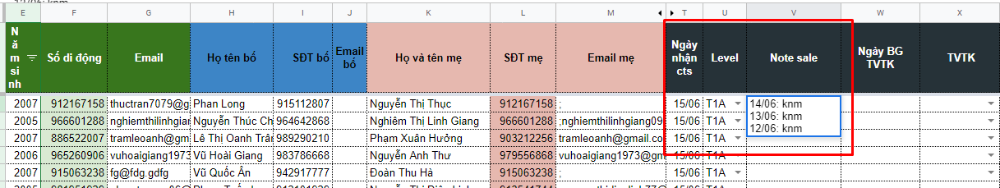

# Quy trình làm việc

Truy cập file làm việc: [https://bit.ly/2UGdnbO](https://bit.ly/2UGdnbO)

Loại trừ cts: [https://docs.google.com/spreadsheets/d/1SLrAJVEl2EUAquWg2rjga4AJTvGK8731Tmncj5nditE/edit#gid=0](https://docs.google.com/spreadsheets/d/1SLrAJVEl2EUAquWg2rjga4AJTvGK8731Tmncj5nditE/edit#gid=0)

## **Bước 1.** Điền cts nhận trong ngày

## **Bước 2. **Gọi điện và note sale

.png>)

### **B2.1. Chuẩn bị:**

Vào** 3i **kiểm tra lịch sử học tập của HV: Đã từng học hay đang học tại SM

### **B2.2. Sử dụng kịch bản..........**

**Công thức:**

* Chào hỏi, tạo ấn tượng với KH
* Khơi gợi sự tò mò, quan tâm
* Khiến KH thích thú, mong muốn tham gia học
* Thôi thúc KH hành động chốt Sale

Kịch bản:

| TVGL                                                                                                                                                                                                                                                                                                                                                                                                                                                                                                                                                                                                                                                                                                                                                                                                                                                                                                                                                                                         | PH/HV |
| -------------------------------------------------------------------------------------------------------------------------------------------------------------------------------------------------------------------------------------------------------------------------------------------------------------------------------------------------------------------------------------------------------------------------------------------------------------------------------------------------------------------------------------------------------------------------------------------------------------------------------------------------------------------------------------------------------------------------------------------------------------------------------------------------------------------------------------------------------------------------------------------------------------------------------------------------------------------------------------------- | ----- |
| 
........... phải không ạ?

Em/Chị là Trang gọi đến từ Anh Ngữ Summit.

(Bỏ qua câu này nếu HV đang học) Tháng.... năm... bạn...... (tên HV) đã học TA tại Summit đấy ạ.
                                                                                                                                                                                                                                                                                                                                                                                                                                                                                                                                                                                                                                                                                                                                                                                  |       |
| Hiện nay SM đang có sản phẩm mới là Toán Tiếng Anh - GenMath                                                                                                                                                                                                                                                                                                                                                                                                                                                                                                                                                                                                                                                                                                                                                                                                                                                                                                                         |       |
| 
Hiện tại GenMath - thuộc Anh ngữ Summit đang có chương trình mời các HV tham gia test để đánh giá trình độ miễn phí cho các con - với phụ trách CT là thầy Nguyễn Trung Kiên ~ hiện là tổ trưởng tổ Toán TA trường Quốc tế Newton.
<ul><li>Ngoài ra các con sẽ được nhận các phần quà là vé CGV, khẩu trang kháng khuẩn của SM và nhiều phần quà khác.</li><li>Không biết trong thời gian này bố mẹ có mong muốn nâng cao/đánh gia trình độ Toán TA/TA chuẩn bị cho đợt hè này của con không ạ...?</li></ul>
Không --> Bắn ngắn ngọn SA/lồng trong lúc giải thích cho PH: cam kết chất lượng = văn bản/GV có nhiều kinh nghiệm đào tạo HV tham gia và giành giải thường trong các kỳ thi Toán TA Quốc tế/lớp sỹ số nhỏ, HS chọn lọc được đánh giá đầu vào chuẩn.

Có --> Khai thác thông tin HV: trường - lớp. Mục tiêu học Toán TA để.... --> Mời lên VP
 |       |
|                                                                                                                                                                                                                                                                                                                                                                                                                                                                                                                                                                                                                                                                                                                                                                                                                                                                                                                                                                                              |       |
|                                                                                                                                                                                                                                                                                                                                                                                                                                                                                                                                                                                                                                                                                                                                                                                                                                                                                                                                                                                              |       |

### **B2.3. Điền level + Sale Note.**

#### Với Cts phải gọi lại nhiều lần. Tại cột Note Sale ghi theo mẫu

* Level cập nhật
* Note sale: Ngày gần nhất ở dòng đầu

## **Bước 3: **Báo cáo ngày

## **Bước 4**. Hỗ trợ HV lên VP Test/Bàn giao cts lên T4-T5

* **Check xem HV đang là kho của ai để tag bạn ấy trong email Nhờ Test**
* Hỗ trợ HV lên VP Test: Gọi điện trước - nhắc lịch Test - hỏi HV đang trên đường chưa?
* Khi HV lên đến VP --> Bàn giao cho TVTK

**Lưu ý: **

* Khi có HV lên VP/muốn học tiếp Junior thì bàn giao ngay --> cho chị Thủy.
* Khi PH/HV đang học tại SM yêu cầu thông tin --> chuyển cho CSHV
