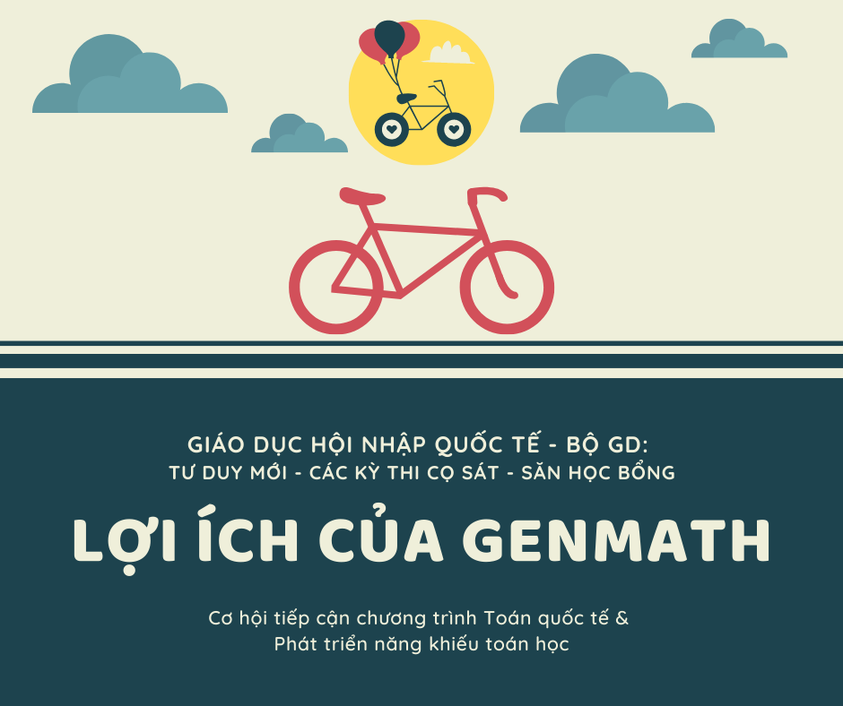

# Lợi ích học GenMath

### **Lợi ích của Genmath?**

* Tham gia các kỳ thi Toán Quốc tế được tổ chức tại**.....** như: **tháng 8** này có các kỳ thi.**.....**
* Phát triển năng khiếu và TƯ DUY Toán học ứng dụng

### Các kỳ thi?

* Sắp tới là kỳ thi IMC AMS được tổ chức vào **tháng 8** này. Hay tháng 9 là kỳ thi Olympic Toán Quốc tế châu Á AIMO cũng được tổ chức tại VN.

### Vì sao nên chọn Genmath -  Summit?

* Giáo viên
* Chương trình học - Nội dung học - Phục vụ kỳ thi?

