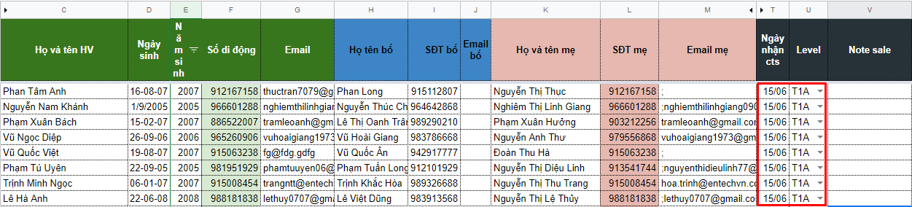

# Quy trình làm việc

Truy cập file làm việc: [https://bit.ly/2UGdnbO](https://bit.ly/2UGdnbO)

Loại trừ cts: [https://docs.google.com/spreadsheets/d/1SLrAJVEl2EUAquWg2rjga4AJTvGK8731Tmncj5nditE/edit\#gid=0](https://docs.google.com/spreadsheets/d/1SLrAJVEl2EUAquWg2rjga4AJTvGK8731Tmncj5nditE/edit#gid=0)

## **Bước 1.** Điền cts nhận trong ngày

## **Bước 2.** Gọi điện và note sale

### **B2.1. Chuẩn bị:**

Vào **3i** kiểm tra lịch sử học tập của HV: Đã từng học hay đang học tại SM

### **B2.2. Sử dụng kịch bản..........**

**Công thức:**

* Chào hỏi, tạo ấn tượng với KH
* Khơi gợi sự tò mò, quan tâm
* Khiến KH thích thú, mong muốn tham gia học
* Thôi thúc KH hành động chốt Sale

Kịch bản:

<table>
  <thead>
    <tr>
      <th style="text-align:left">TVGL</th>
      <th style="text-align:left">PH/HV</th>
    </tr>
  </thead>
  <tbody>
    <tr>
      <td style="text-align:left">
        
........... pha&#x309;i kh&#xF4;ng a&#x323;?

        
Em/Chi&#x323; la&#x300; Trang go&#x323;i &#x111;&#xEA;&#x301;n t&#x1B0;&#x300;
          Anh Ng&#x1B0;&#x303; Summit.

        
(Bo&#x309; qua c&#xE2;u na&#x300;y n&#xEA;&#x301;u HV &#x111;ang ho&#x323;c)
          Tha&#x301;ng.... n&#x103;m... ba&#x323;n...... (t&#xEA;n HV) &#x111;a&#x303;
          ho&#x323;c TA ta&#x323;i Summit &#x111;&#xE2;&#x301;y a&#x323;.

      </td>
      <td style="text-align:left"></td>
    </tr>
    <tr>
      <td style="text-align:left">Hi&#xEA;&#x323;n nay SM &#x111;ang co&#x301; sa&#x309;n ph&#xE2;&#x309;m
        m&#x1A1;&#x301;i la&#x300; Toa&#x301;n Ti&#xEA;&#x301;ng Anh - GenMath</td>
      <td
      style="text-align:left"></td>
    </tr>
    <tr>
      <td style="text-align:left">
        
Hi&#xEA;&#x323;n ta&#x323;i GenMath - thu&#xF4;&#x323;c Anh ng&#x1B0;&#x303;
          Summit &#x111;ang co&#x301; ch&#x1B0;&#x1A1;ng tri&#x300;nh m&#x1A1;&#x300;i
          ca&#x301;c HV tham gia test &#x111;&#xEA;&#x309; &#x111;a&#x301;nh gia&#x301;
          tri&#x300;nh &#x111;&#xF4;&#x323; mi&#xEA;&#x303;n phi&#x301; cho ca&#x301;c
          con - v&#x1A1;&#x301;i phu&#x323; tra&#x301;ch CT la&#x300; th&#xE2;&#x300;y
          Nguy&#xEA;&#x303;n Trung Ki&#xEA;n ~ hi&#xEA;&#x323;n la&#x300; t&#xF4;&#x309;
          tr&#x1B0;&#x1A1;&#x309;ng t&#xF4;&#x309; Toa&#x301;n TA tr&#x1B0;&#x1A1;&#x300;ng
          Qu&#xF4;&#x301;c t&#xEA;&#x301; Newton.

        <ul>
          <li>Ngoa&#x300;i ra ca&#x301;c con se&#x303; &#x111;&#x1B0;&#x1A1;&#x323;c
            nh&#xE2;&#x323;n ca&#x301;c ph&#xE2;&#x300;n qua&#x300; la&#x300; ve&#x301;
            CGV, kh&#xE2;&#x309;u trang kha&#x301;ng khu&#xE2;&#x309;n cu&#x309;a SM
            va&#x300; nhi&#xEA;&#x300;u ph&#xE2;&#x300;n qua&#x300; kha&#x301;c.</li>
          <li>Kh&#xF4;ng bi&#xEA;&#x301;t trong th&#x1A1;&#x300;i gian na&#x300;y b&#xF4;&#x301;
            me&#x323; co&#x301; mong mu&#xF4;&#x301;n n&#xE2;ng cao/&#x111;a&#x301;nh
            gia tri&#x300;nh &#x111;&#xF4;&#x323; Toa&#x301;n TA/TA chu&#xE2;&#x309;n
            bi&#x323; cho &#x111;&#x1A1;&#x323;t he&#x300; na&#x300;y cu&#x309;a con
            kh&#xF4;ng a&#x323;...?</li>
        </ul>
        
Kh&#xF4;ng --&gt; B&#x103;&#x301;n ng&#x103;&#x301;n ngo&#x323;n SA/l&#xF4;&#x300;ng
          trong lu&#x301;c gia&#x309;i thi&#x301;ch cho PH: cam k&#xEA;&#x301;t ch&#xE2;&#x301;t
          l&#x1B0;&#x1A1;&#x323;ng = v&#x103;n ba&#x309;n/GV co&#x301; nhi&#xEA;&#x300;u
          kinh nghi&#xEA;&#x323;m &#x111;a&#x300;o ta&#x323;o HV tham gia va&#x300;
          gia&#x300;nh gia&#x309;i th&#x1B0;&#x1A1;&#x300;ng trong ca&#x301;c ky&#x300;
          thi Toa&#x301;n TA Qu&#xF4;&#x301;c t&#xEA;&#x301;/l&#x1A1;&#x301;p sy&#x303;
          s&#xF4;&#x301; nho&#x309;, HS cho&#x323;n lo&#x323;c &#x111;&#x1B0;&#x1A1;&#x323;c
          &#x111;a&#x301;nh gia&#x301; &#x111;&#xE2;&#x300;u va&#x300;o chu&#xE2;&#x309;n.

        
Co&#x301; --&gt; Khai tha&#x301;c th&#xF4;ng tin HV: tr&#x1B0;&#x1A1;&#x300;ng
          - l&#x1A1;&#x301;p. Mu&#x323;c ti&#xEA;u ho&#x323;c Toa&#x301;n TA &#x111;&#xEA;&#x309;....
          --&gt; M&#x1A1;&#x300;i l&#xEA;n VP

      </td>
      <td style="text-align:left"></td>
    </tr>
    <tr>
      <td style="text-align:left"></td>
      <td style="text-align:left"></td>
    </tr>
    <tr>
      <td style="text-align:left"></td>
      <td style="text-align:left"></td>
    </tr>
  </tbody>
</table>

### **B2.3. Điền level + Sale Note.**

#### Với Cts phải gọi lại nhiều lần. Tại cột Note Sale ghi theo mẫu

* Level cập nhật
* Note sale: Ngày gần nhất ở dòng đầu

## **Bước 3:** Báo cáo ngày

## **Bước 4**. Hỗ trợ HV lên VP Test/Bàn giao cts lên T4-T5

* Hỗ trợ HV lên VP Test: Gọi điện trước - nhắc lịch Test - hỏi HV đang trên đường chưa?
* Khi HV lên đến VP --&gt; Bàn giao cho TVTK

**Lưu ý:** 

* Khi có HV lên VP/muốn học tiếp Junior thì bàn giao ngay --&gt; cho chị Thủy.
* Khi PH/HV đang học tại SM yêu cầu thông tin --&gt; chuyển cho CSHV

