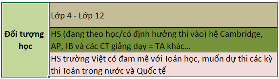

# Đối tượng học, SP, gói học

### Đối tượng học

### 3 cấp độ

### Học phí & Thời gian học & Đầu ra

* **Học phí gốc:** 200 - 250k/giờ ~ chưa tính ưu đãi tại thời điểm/combo/đóng sớm.
* **Số buổi/cấp độ:** 20 buổi ~ **4,5 tháng**
* **Thời gian học:** 1 buổi **2,5 giờ**. 1 tuần - 1 buổi. Tổng 50 giờ
* **Đầu ra:** Cam kết chất lượng cho từng cấp độ như trên
* **Giáo trình:** Ở cấp độ đầu tiên - Cơ bản sẽ sử dụng giáo trình Cambridge. Ở 2 cấp độ sau là giáo trình do SM tự biên soạn.

