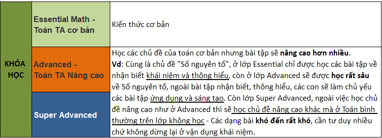

# Đối tượng học, SP, gói học

### Đối tượng học

### 3 cấp độ

### Học phí & Thời gian học & Đầu ra

* **Học phí gốc:** 200 - 250k/giờ ~ chưa tính ưu đãi tại thời điểm/combo/đóng sớm.
* **Số buổi/cấp độ:** 20 buổi ~ **4,5 tháng**
* **Thời gian học:** 1 buổi **2,5 giờ**. 1 tuần - 1 buổi. Tổng 50 giờ
* **Đầu ra:** Cam kết chất lượng cho từng cấp độ như trên
* **Giáo trình:** Ở cấp độ đầu tiên - Cơ bản sẽ sử dụng giáo trình Cambridge. Ở 2 cấp độ sau là giáo trình do SM tự biên soạn.

### Kịch bản

<table>
  <thead>
    <tr>
      <th style="text-align:left"></th>
      <th style="text-align:left"></th>
    </tr>
  </thead>
  <tbody>
    <tr>
      <td style="text-align:left">
        
<b>.................... pha&#x309;i kh&#xF4;ng a&#x323;?</b>
        

        
<b>Em la&#x300; Trang, go&#x323;i &#x111;&#xEA;&#x301;n t&#x1B0;&#x300; CT ho&#x323;c Toa&#x301;n TA cu&#x309;a SM. </b>
        

        
<b>Nh&#xE2;n di&#x323;p ra m&#x103;&#x301;t CT ho&#x323;c m&#x1A1;&#x301;i, SM co&#x301; CT tri &#xE2;n/t&#x103;&#x323;ng qua&#x300; cho ca&#x301;c HV khi tham gia Test tri&#x300;nh &#x111;&#xF4;&#x323; Toa&#x301;n - TA mi&#xEA;&#x303;n phi&#x301; ta&#x323;i VP.</b>
        

        

        
<b>*GenMath</b> - Toa&#x301;n TA ~Toa&#x301;n Song ng&#x1B0;&#x303; - hi&#xEA;&#x323;n
          la&#x300; m&#xF4; hi&#x300;nh ho&#x323;c Toa&#x301;n m&#x1A1;&#x301;i ma&#x300;
          BGD &#x111;&#x1B0;a ra, giu&#x301;p tre&#x309; pha&#x301;t tri&#xEA;&#x309;n
          Toa&#x301;n ho&#x323;c t&#x1B0; duy, Toa&#x301;n &#x1B0;&#x301;ng du&#x323;ng,
          va&#x300; co&#x301; c&#x1A1; h&#xF4;&#x323;i ti&#xEA;&#x301;p c&#xE2;&#x323;n
          v&#x1A1;&#x301;i ca&#x301;c CT Toa&#x301;n qu&#xF4;&#x301;c t&#xEA;&#x301;.
          Co&#x301; r&#xE2;&#x301;t nhi&#xEA;&#x300;u ca&#x301;c cu&#xF4;&#x323;c
          thi Toa&#x301;n qu&#xF4;&#x301;c t&#xEA;&#x301; &#x111;&#x1B0;&#x1A1;&#x323;c
          t&#xF4;&#x309; ch&#x1B0;&#x301;c ha&#x300;ng n&#x103;m ta&#x323;i VN, g&#xE2;&#x300;n
          &#x111;&#xE2;y nh&#xE2;&#x301;t va&#x300;o tha&#x301;ng 8 na&#x300;y la&#x300;
          cu&#xF4;&#x323;c thi.......... tha&#x301;ng 9 na&#x300;y la&#x300; cu&#xF4;&#x323;c
          thi......

      </td>
      <td style="text-align:left"></td>
    </tr>
    <tr>
      <td style="text-align:left">
        
<b>Kh&#xF4;ng bi&#xEA;&#x301;t trong th&#x1A1;&#x300;i gian na&#x300;y, anh/chi&#x323; &#x111;a&#x303; co&#x301; k&#xEA;&#x301; hoa&#x323;ch mu&#xF4;&#x301;n n&#xE2;ng cao/&#x111;a&#x301;nh gia&#x301; tri&#x300;nh &#x111;&#xF4;&#x323; Toa&#x301;n TA/TA cho ca&#x301;c ba&#x323;n ch&#x1B0;a a&#x323;?</b>
        

        
<b>*N&#xEA;&#x301;u </b>con &#x111;a&#x303;/&#x111;ang ho&#x323;c &#x1A1;&#x309;
          SM: Kh&#xF4;ng bi&#xEA;&#x301;t trong th&#x1A1;&#x300;i gian na&#x300;y,
          ngoa&#x300;i vi&#xEA;&#x323;c ho&#x323;c TA, ba&#x323;n nha&#x300; mi&#x300;nh
          co&#x301; d&#x1B0;&#x323; &#x111;i&#x323;nh tham gia ky&#x300; thi Toa&#x301;n
          trong n&#x1B0;&#x1A1;&#x301;c/qu&#xF4;&#x301;c na&#x300;o kh&#xF4;ng? (Co&#x301;
          d&#x1B0;&#x323; &#x111;i&#x323;nh d&#x1B0;&#x323; thi va&#x300;o h&#xEA;&#x323;
          Cambridge,AP,IP....)
           --&gt; Khi na&#x300;o d&#x1B0;&#x323; &#x111;i&#x323;nh thi? Co&#x301;
          c&#xE2;&#x300;n b&#xF4;&#x309; sung ki&#xEA;&#x301;n th&#x1B0;&#x301;c
          kh&#xF4;ng?

      </td>
      <td style="text-align:left"></td>
    </tr>
    <tr>
      <td style="text-align:left">
        
<b>Hook, SA:</b>
        

        
Toa&#x301;n TA GenMath &#x111;&#x1B0;&#x1A1;&#x323;c phu&#x323; tra&#x301;ch
          b&#x1A1;&#x309;i th&#xE2;&#x300;y Nguy&#xEA;&#x303;n Trung Ki&#xEA;n ~
          hi&#xEA;&#x323;n la&#x300; t&#xF4;&#x309; tr&#x1B0;&#x1A1;&#x309;ng T&#xF4;&#x309;
          b&#xF4;&#x323; m&#xF4;n Toa&#x301;n TA tr&#x1B0;&#x1A1;&#x300;ng Newton.
          Th&#xE2;&#x300;y &#x111;a&#x303; tham gia &#x111;a&#x300;o ta&#x323;o r&#xE2;&#x301;t
          nhi&#xEA;&#x300;u ca&#x301;c l&#x1B0;&#x301;a HS ho&#x323;c SAT.... da&#x300;nh
          gia&#x309;i cao trong ca&#x301;c ky&#x300; thi.

        
SA1: &#x110;&#xF4;&#x323;i ngu&#x303; GV co&#x301; chuy&#xEA;n m&#xF4;n,
          CL cao

        
SA2: Ba&#x300;i ki&#xEA;&#x309;m tra &#x111;&#xE2;&#x300;u va&#x300;o
          ky&#x303; l&#x1B0;&#x1A1;&#x303;ng

        
SA3: Giu&#x301;p ba&#x323;n co&#x301; m&#xF4;i tr&#x1B0;&#x1A1;&#x300;ng
          ho&#x323;c t&#xE2;&#x323;p cho&#x323;n lo&#x323;c, sy&#x303; s&#xF4;&#x301;
          l&#x1A1;&#x301;p nho&#x309;.

      </td>
      <td style="text-align:left"></td>
    </tr>
    <tr>
      <td style="text-align:left">
        
<b>Ch&#xF4;&#x301;t: </b>
        

        <ul>
          <li>Ho&#x309;i khu v&#x1B0;&#x323;c:</li>
          <li>Th&#x1A1;&#x300;i gian Test</li>
        </ul>
      </td>
      <td style="text-align:left"></td>
    </tr>
  </tbody>
</table>

